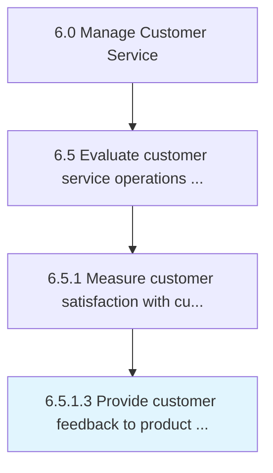

# Provide customer feedback to product management on customer service experience

> Handing over data to management to analyze common issues in regards to customer service.

## Overview

Activity 6.5.1.3 is an activity within the Manage Customer Service framework. 

Handing over data to management to analyze common issues in regards to customer service.

## Process Hierarchy



## Key Statistics

| Metric | Value |
|--------|-------|
| APQC Code | 18126 |
| Hierarchy ID | 6.5.1.3 |
| Level | Activity |
| Parent | [6.5.1](../) |
| Sub-Processes | 0 |


## GraphDL Semantic Structure

```
provide.CustomerFeedback.to.ProductManagementOnCustomerServiceExperience
```

| Component | Value | Description |
|-----------|-------|-------------|
| Verb | `provide` | Primary action |
| Object | `customer feedback` | Direct object |
| Preposition | `to` | Relationship |
| PrepObject | `product management on customer service experience` | Indirect object |


## Related Concepts

- [CustomerFeedback](/concepts/CustomerFeedback)
- [ProductManagementOnCustomerServiceExperience](/concepts/ProductManagementOnCustomerServiceExperience)


---

*Source: APQC PCF 18126 (6.5.1.3) - APQC*
