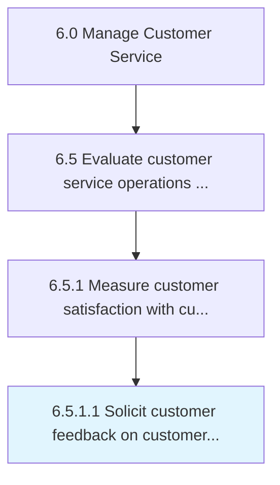

# Solicit customer feedback on customer service experience

> Creating an avenue for which the customer can provide feedback on their experience with how their inquiry, problem, or request was handled.

## Overview

Activity 6.5.1.1 is an activity within the Manage Customer Service framework. 

Creating an avenue for which the customer can provide feedback on their experience with how their inquiry, problem, or request was handled.

## Process Hierarchy



## Key Statistics

| Metric | Value |
|--------|-------|
| APQC Code | 11687 |
| Hierarchy ID | 6.5.1.1 |
| Level | Activity |
| Parent | [6.5.1](../) |
| Sub-Processes | 0 |


## GraphDL Semantic Structure

```
solicit.CustomerFeedback.on.CustomerServiceExperience
```

| Component | Value | Description |
|-----------|-------|-------------|
| Verb | `solicit` | Primary action |
| Object | `customer feedback` | Direct object |
| Preposition | `on` | Relationship |
| PrepObject | `customer service experience` | Indirect object |


## Related Concepts

- CustomerFeedback
- CustomerServiceExperience


---

*Source: APQC PCF 11687 (6.5.1.1) - APQC*
