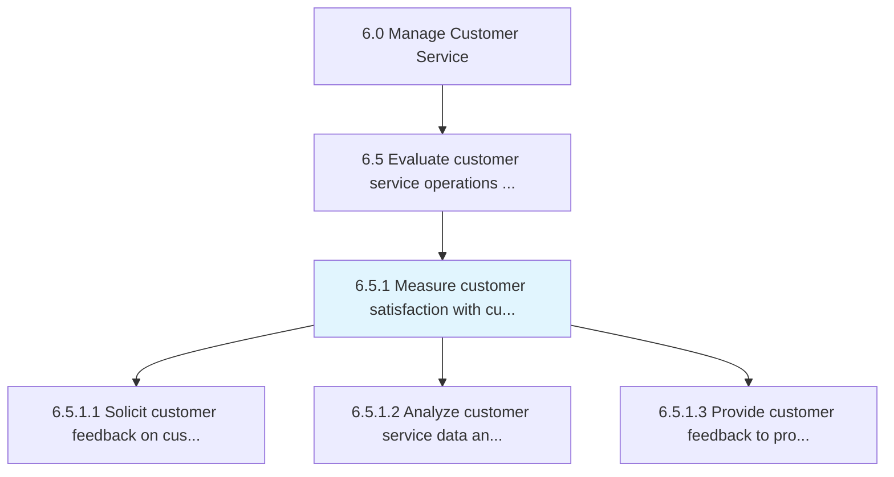
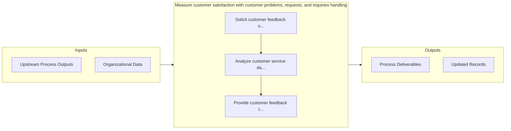

# Measure customer satisfaction with customer problems, requests, and inquiries handling

> Calculating satisfaction levels of customers by effectively evaluating the process of handling requests/inquiries of customers.

## Overview

Process 6.5.1 is a core process that defines the specific procedures for measure customer satisfaction with customer problems, requests, and inquiries handling. 

Calculating satisfaction levels of customers by effectively evaluating the process of handling requests/inquiries of customers. Effectively calculate the performance of customer-requests/inquiries handling and resolution. Obtain information regarding requests/inquiries handling and resolution through customer feedback. Use it to explore new ideas and opportunities for enhanced customer requests/inquiries handling and resolution process.

## Process Hierarchy



## Key Statistics

| Metric | Value |
|--------|-------|
| APQC Code | 10401 |
| Hierarchy ID | 6.5.1 |
| Level | Process |
| Parent | [6.5](../) |
| Sub-Processes | 3 |


## GraphDL Semantic Structure

```
measure.CustomerSatisfaction.with.CustomerProblemsRequestsAndInquiriesHandling
```

| Component | Value | Description |
|-----------|-------|-------------|
| Verb | `measure` | Primary action |
| Object | `customer satisfaction` | Direct object |
| Preposition | `with` | Relationship |
| PrepObject | `customer problems, requests, and inquiries handling` | Indirect object |


## Process Flow



## Sub-Processes

| Process | Hierarchy ID | Description |
|---------|-------------|-------------|
| [Solicit customer feedback on customer service experience](./SolicitCustomerFeedbackOnCustomerServiceExperience) | 6.5.1.1 | Creating an avenue for which the customer can provide feedback on their experience with how their in |
| [Analyze customer service data and identify improvement opportunities](./AnalyzeCustomerServiceDataAndIdentifyImprovementOpportunities) | 6.5.1.2 | Reviewing customer service feedback to identify areas in which improvements can be made |
| [Provide customer feedback to product management on customer service experience](./ProvideCustomerFeedbackToProductManagementOnCustomerServiceExperience) | 6.5.1.3 | Handing over data to management to analyze common issues in regards to customer service |


## Related Concepts

- [CustomerSatisfaction](/concepts/CustomerSatisfaction)
- [CustomerProblems](/concepts/CustomerProblems)
- [CustomerSatisfaction](/concepts/CustomerSatisfaction)
- [Requests](/concepts/Requests)
- [CustomerSatisfaction](/concepts/CustomerSatisfaction)
- [InquiriesHandling](/concepts/InquiriesHandling)


---

*Source: APQC PCF 10401 (6.5.1) - APQC*
