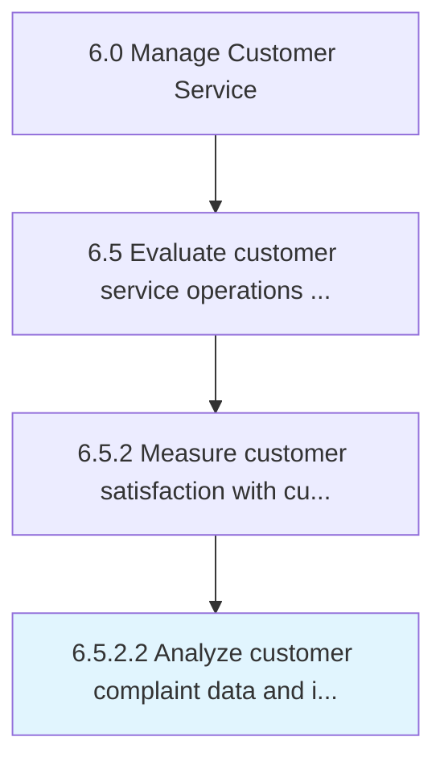

# Analyze customer complaint data and identify improvement opportunities

> Examining the information obtained through handling and resolving complaints for development/improvement opportunities.

## Overview

Activity 6.5.2.2 is an activity within the Manage Customer Service framework. 

Examining the information obtained through handling and resolving complaints for development/improvement opportunities. Categorize the customer complaints data on the basis of speed, accuracy, courtesy, price, product choice, availability, hours, location, etc. Determine complaint patterns in order to diagnose areas needing enhancement.

## Process Hierarchy



## Key Statistics

| Metric | Value |
|--------|-------|
| APQC Code | 11237 |
| Hierarchy ID | 6.5.2.2 |
| Level | Activity |
| Parent | [6.5.2](../) |
| Sub-Processes | 0 |


## GraphDL Semantic Structure

```
analyze.CustomerComplaintDataAndIdentifyImprovementOpportunities
```

| Component | Value | Description |
|-----------|-------|-------------|
| Verb | `analyze` | Primary action |
| Object | `customer complaint data and identify improvement opportunities` | Direct object |


## Related Concepts

- [CustomerComplaintData](/concepts/CustomerComplaintData)
- [IdentifyImprovementOpportunities](/concepts/IdentifyImprovementOpportunities)


---

*Source: APQC PCF 11237 (6.5.2.2) - APQC*
