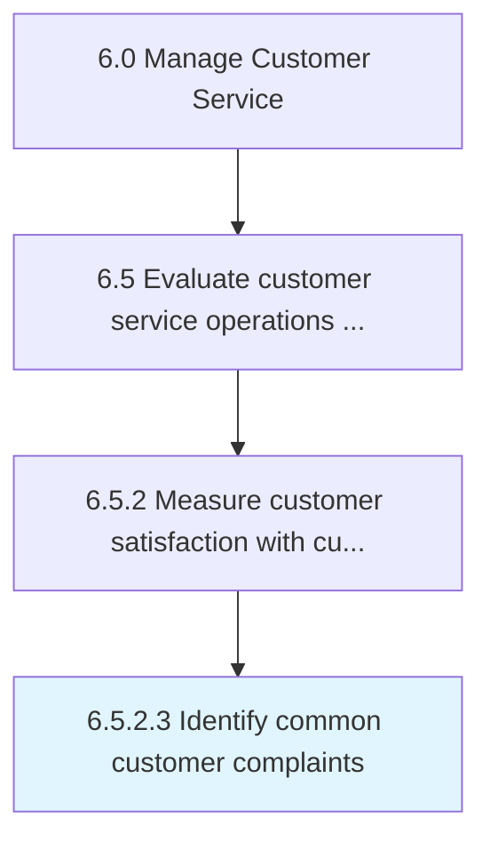

# Identify common customer complaints

> Determining complaint patterns in order to identify common issues.

## Overview

Activity 6.5.2.3 is an activity within the Manage Customer Service framework. 

Determining complaint patterns in order to identify common issues. Document common problems for correction.

## Process Hierarchy



## Key Statistics

| Metric | Value |
|--------|-------|
| APQC Code | 11689 |
| Hierarchy ID | 6.5.2.3 |
| Level | Activity |
| Parent | [6.5.2](../) |
| Sub-Processes | 0 |


## GraphDL Semantic Structure

```
identify.CommonCustomerComplaints
```

| Component | Value | Description |
|-----------|-------|-------------|
| Verb | `identify` | Primary action |
| Object | `common customer complaints` | Direct object |


## Related Concepts

- [CommonCustomerComplaints](/concepts/CommonCustomerComplaints)


---

*Source: APQC PCF 11689 (6.5.2.3) - APQC*
