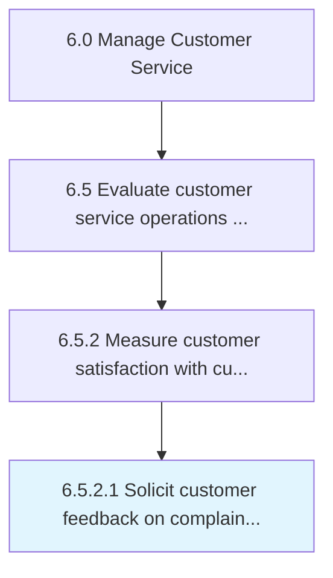

# Solicit customer feedback on complaint handling and resolution

> Requesting customer feedback on the process of handling and resolving customer complaints.

## Overview

Activity 6.5.2.1 is an activity within the Manage Customer Service framework. 

Requesting customer feedback on the process of handling and resolving customer complaints. Obtain information about the effectiveness and performance of the customer complaint handling process from the customers through various means (e.g., online and by phone).

## Process Hierarchy



## Key Statistics

| Metric | Value |
|--------|-------|
| APQC Code | 11236 |
| Hierarchy ID | 6.5.2.1 |
| Level | Activity |
| Parent | [6.5.2](../) |
| Sub-Processes | 0 |


## GraphDL Semantic Structure

```
solicit.CustomerFeedback.on.ComplaintHandlingAndResolution
```

| Component | Value | Description |
|-----------|-------|-------------|
| Verb | `solicit` | Primary action |
| Object | `customer feedback` | Direct object |
| Preposition | `on` | Relationship |
| PrepObject | `complaint handling and resolution` | Indirect object |


## Related Concepts

- CustomerFeedback
- ComplaintHandling
- CustomerFeedback
- Resolution


---

*Source: APQC PCF 11236 (6.5.2.1) - APQC*
