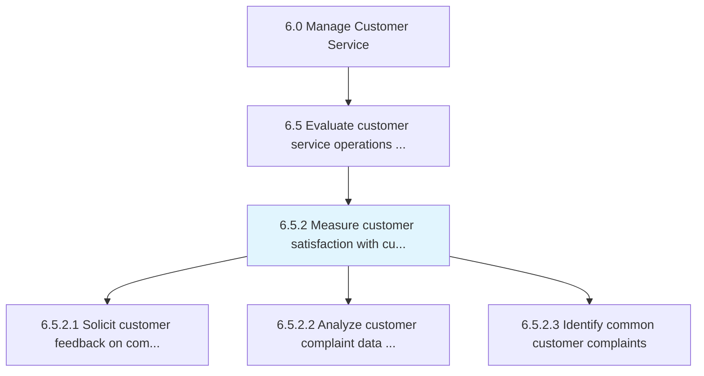
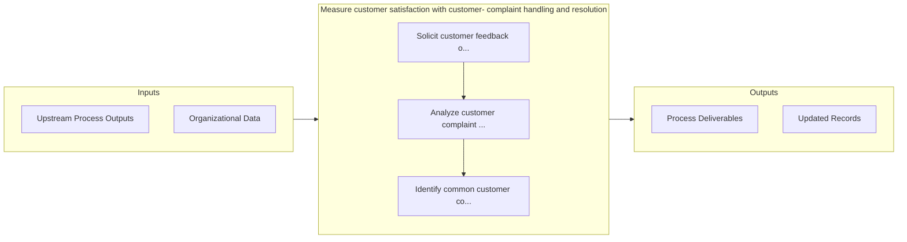

# Measure customer satisfaction with customer- complaint handling and resolution

> Measuring the satisfaction level of customers as pertains to how their complaints are handled and resolved.

## Overview

Process 6.5.2 is a core process that defines the specific procedures for measure customer satisfaction with customer- complaint handling and resolution. 

Measuring the satisfaction level of customers as pertains to how their complaints are handled and resolved. This process element requires the organization to estimate the customers level of fulfillment with the process reconciling their complaints and towards the objective of ensuring customer retention. The feedback received can be used to develop concepts for new opportunities to boost the level of customer satisfaction.

## Process Hierarchy



## Key Statistics

| Metric | Value |
|--------|-------|
| APQC Code | 10402 |
| Hierarchy ID | 6.5.2 |
| Level | Process |
| Parent | [6.5](../) |
| Sub-Processes | 3 |


## GraphDL Semantic Structure

```
measure.CustomerSatisfaction.with.CustomerComplaintHandlingAndResolution
```

| Component | Value | Description |
|-----------|-------|-------------|
| Verb | `measure` | Primary action |
| Object | `customer satisfaction` | Direct object |
| Preposition | `with` | Relationship |
| PrepObject | `customer- complaint handling and resolution` | Indirect object |


## Process Flow



## Sub-Processes

| Process | Hierarchy ID | Description |
|---------|-------------|-------------|
| [Solicit customer feedback on complaint handling and resolution](./SolicitCustomerFeedbackOnComplaintHandlingAndResolution) | 6.5.2.1 | Requesting customer feedback on the process of handling and resolving customer complaints |
| [Analyze customer complaint data and identify improvement opportunities](./AnalyzeCustomerComplaintDataAndIdentifyImprovementOpportunities) | 6.5.2.2 | Examining the information obtained through handling and resolving complaints for development/improve |
| [Identify common customer complaints](./IdentifyCommonCustomerComplaints) | 6.5.2.3 | Determining complaint patterns in order to identify common issues |


## Related Concepts

- CustomerSatisfaction
- CustomerComplaintHandling
- CustomerSatisfaction
- Resolution


---

*Source: APQC PCF 10402 (6.5.2) - APQC*
