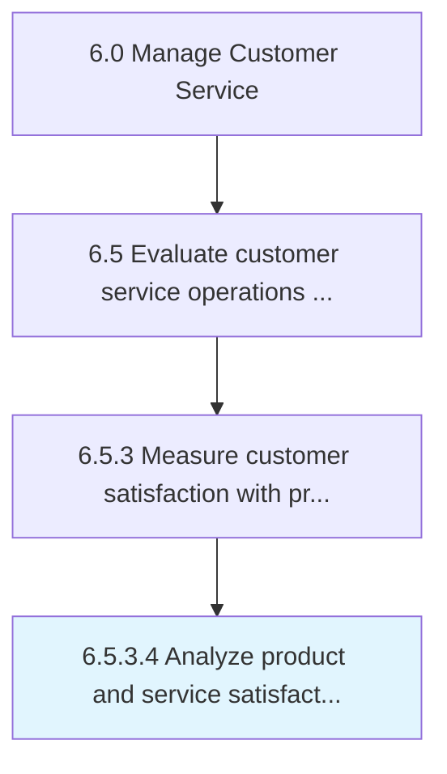

# Analyze product and service satisfaction data and identify improvement opportunities

> Assessing the information collected on customer satisfaction levels with products/services in order to determine areas for improvement.

## Overview

Activity 6.5.3.4 is an activity within the Manage Customer Service framework. 

Assessing the information collected on customer satisfaction levels with products/services in order to determine areas for improvement. Examine the data and information extracted from the customer feedback and reviews to measure the satisfaction levels of the customers. Identify opportunities that could enhance the customer satisfaction levels and the overall customer service strategy.

## Process Hierarchy



## Key Statistics

| Metric | Value |
|--------|-------|
| APQC Code | 11240 |
| Hierarchy ID | 6.5.3.4 |
| Level | Activity |
| Parent | [6.5.3](../) |
| Sub-Processes | 0 |


## GraphDL Semantic Structure

```
analyze.ProductAndServiceSatisfactionDataAndIdentifyImprovementOpportunities
```

| Component | Value | Description |
|-----------|-------|-------------|
| Verb | `analyze` | Primary action |
| Object | `product and service satisfaction data and identify improvement opportunities` | Direct object |


## Related Concepts

- [Product](/concepts/Product)
- [ServiceSatisfactionData](/concepts/ServiceSatisfactionData)
- [IdentifyImprovementOpportunities](/concepts/IdentifyImprovementOpportunities)


---

*Source: APQC PCF 11240 (6.5.3.4) - APQC*
