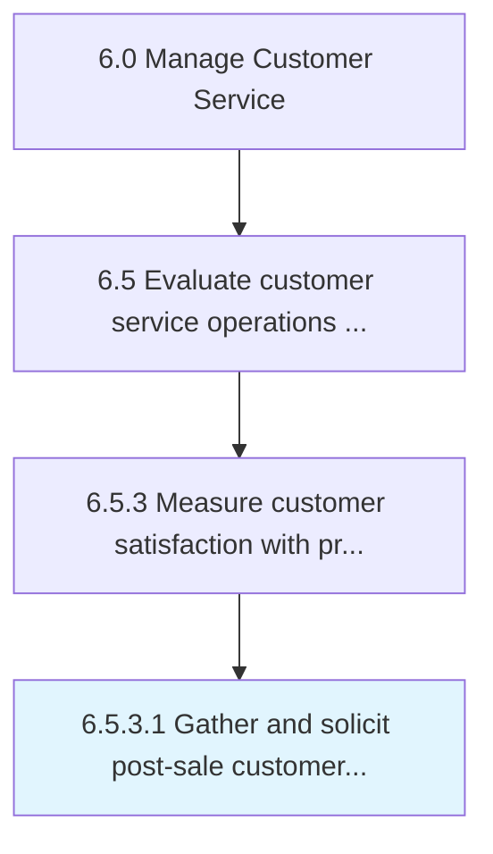

# Gather and solicit post-sale customer feedback on products and services

> Obtaining customer feedback/review on the quality and utility derived from the products/services after the sale is complete.

## Overview

Activity 6.5.3.1 is an activity within the Manage Customer Service framework. 

Obtaining customer feedback/review on the quality and utility derived from the products/services after the sale is complete. Use techniques such as surveys, feedback boxes, and user activity and usability tests.

## Process Hierarchy



## Key Statistics

| Metric | Value |
|--------|-------|
| APQC Code | 11238 |
| Hierarchy ID | 6.5.3.1 |
| Level | Activity |
| Parent | [6.5.3](../) |
| Sub-Processes | 0 |


## GraphDL Semantic Structure

```
gather.AndSolicitPostsaleCustomerFeedback.on.ProductsAndServices
```

| Component | Value | Description |
|-----------|-------|-------------|
| Verb | `gather` | Primary action |
| Object | `and solicit post-sale customer feedback` | Direct object |
| Preposition | `on` | Relationship |
| PrepObject | `products and services` | Indirect object |


---

*Source: APQC PCF 11238 (6.5.3.1) - APQC*
