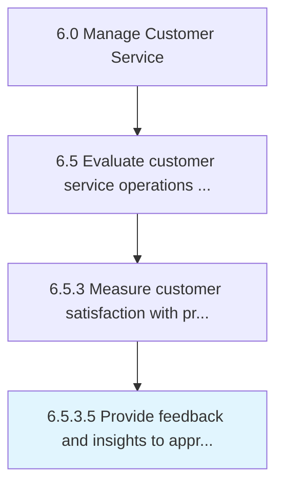

# Provide feedback and insights to appropriate teams (product design/development, marketing, manufacturing)

> Providing feedback from customers on products/services to the product management team.

## Overview

Activity 6.5.3.5 is an activity within the Manage Customer Service framework. 

Providing feedback from customers on products/services to the product management team. Analyze information collected through Gather and solicit post-sale customer feedback on products/services [11238]. Share with the product management team for consideration while improving existing offerings or developing new products/services.

## Process Hierarchy



## Key Statistics

| Metric | Value |
|--------|-------|
| APQC Code | 11241 |
| Hierarchy ID | 6.5.3.5 |
| Level | Activity |
| Parent | [6.5.3](../) |
| Sub-Processes | 0 |


## GraphDL Semantic Structure

```
provide.FeedbackAndInsights.to.AppropriateTeamsProductDesigndevelopmentMarketingManufacturing
```

| Component | Value | Description |
|-----------|-------|-------------|
| Verb | `provide` | Primary action |
| Object | `feedback and insights` | Direct object |
| Preposition | `to` | Relationship |
| PrepObject | `appropriate teams (product design/development, marketing, manufacturing)` | Indirect object |


---

*Source: APQC PCF 11241 (6.5.3.5) - APQC*
