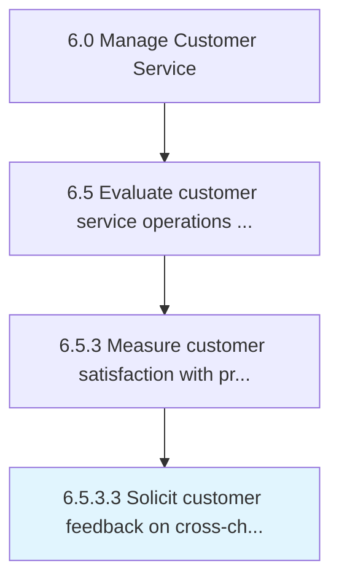

# Solicit customer feedback on cross-channel experience

> Engaging with the customer to understand their cross-channel experience.

## Overview

Activity 6.5.3.3 is an activity within the Manage Customer Service framework. 

Engaging with the customer to understand their cross-channel experience. Find out what channels were effective and what areas need improvement.

## Process Hierarchy



## Key Statistics

| Metric | Value |
|--------|-------|
| APQC Code | 20117 |
| Hierarchy ID | 6.5.3.3 |
| Level | Activity |
| Parent | [6.5.3](../) |
| Sub-Processes | 0 |


## GraphDL Semantic Structure

```
solicit.CustomerFeedback.on.CrosschannelExperience
```

| Component | Value | Description |
|-----------|-------|-------------|
| Verb | `solicit` | Primary action |
| Object | `customer feedback` | Direct object |
| Preposition | `on` | Relationship |
| PrepObject | `cross-channel experience` | Indirect object |


---

*Source: APQC PCF 20117 (6.5.3.3) - APQC*
