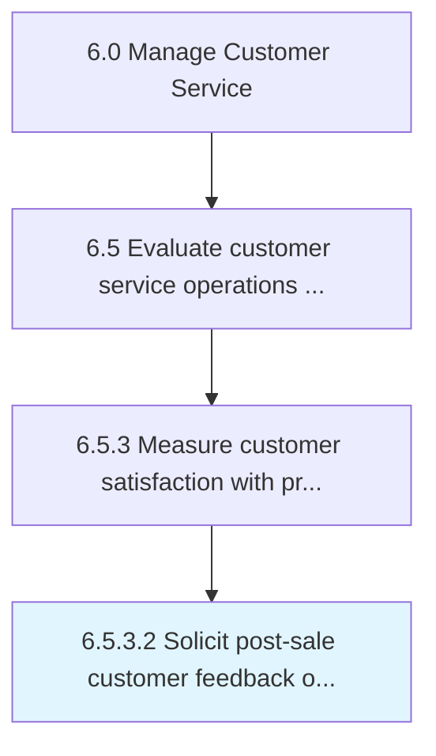

# Solicit post-sale customer feedback on ad effectiveness

> Assessing the influence of advertisements on purchasing behavior.

## Overview

Activity 6.5.3.2 is an activity within the Manage Customer Service framework. 

Assessing the influence of advertisements on purchasing behavior. Use techniques such as surveys and product recognition tests, questionnaires or feedback flyers, and toll-free numbers in order to encourage customer interaction after the sale.

## Process Hierarchy



## Key Statistics

| Metric | Value |
|--------|-------|
| APQC Code | 11239 |
| Hierarchy ID | 6.5.3.2 |
| Level | Activity |
| Parent | [6.5.3](../) |
| Sub-Processes | 0 |


## GraphDL Semantic Structure

```
solicit.PostsaleCustomerFeedback.on.AdEffectiveness
```

| Component | Value | Description |
|-----------|-------|-------------|
| Verb | `solicit` | Primary action |
| Object | `post-sale customer feedback` | Direct object |
| Preposition | `on` | Relationship |
| PrepObject | `ad effectiveness` | Indirect object |


---

*Source: APQC PCF 11239 (6.5.3.2) - APQC*
