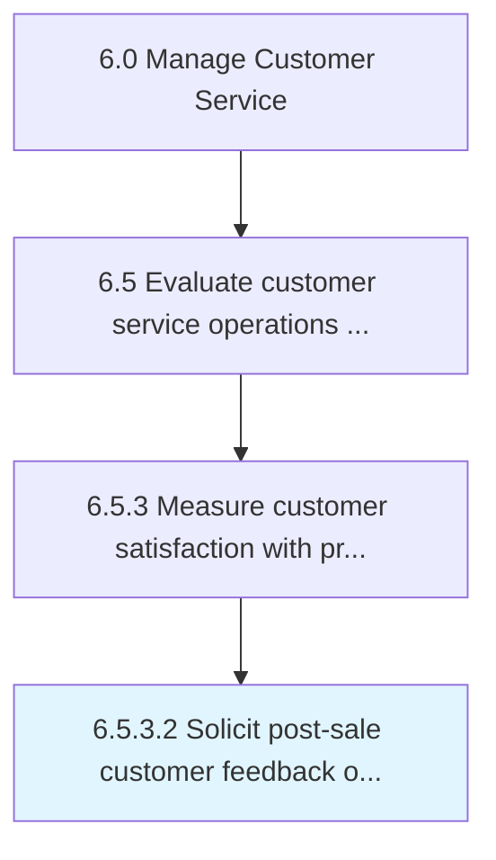

# Solicit post-sale customer feedback on ad effectiveness

> Assessing the influence of advertisements on purchasing behavior.

## Overview

This activity encompasses the end-to-end process of solicit post-sale customer feedback on ad effectiveness within the customer service and support domain. It involves coordinating cross-functional teams, applying standardized methodologies, and leveraging organizational data to ensure consistent and effective outcomes. The process is aligned with the broader Manage Customer Service framework (APQC 6.5.3.2) and supports strategic objectives by translating operational requirements into actionable procedures.

Effective execution of this activity requires clear ownership, well-defined inputs and outputs, and continuous monitoring against established benchmarks. Organizations that excel at this process typically integrate it with upstream planning activities and downstream performance measurement, creating a feedback loop that drives ongoing improvement and adaptation to changing business conditions.


## Process Hierarchy



## Key Statistics

| Metric | Value |
|--------|-------|
| APQC Code | 11239 |
| Hierarchy ID | 6.5.3.2 |
| Level | Activity |
| Parent | [6.5.3](../) |
| Sub-Processes | 0 |


## GraphDL Semantic Structure

```graphdl
solicit.PostsaleCustomerFeedback.on.AdEffectiveness
```

| Component | Value | Description |
|-----------|-------|-------------|
| Verb | `solicit` | Primary action |
| Object | `post-sale customer feedback` | Direct object |
| Preposition | `on` | Relationship |
| PrepObject | `ad effectiveness` | Indirect object |


---

*Source: APQC PCF 11239 (6.5.3.2) - APQC*
