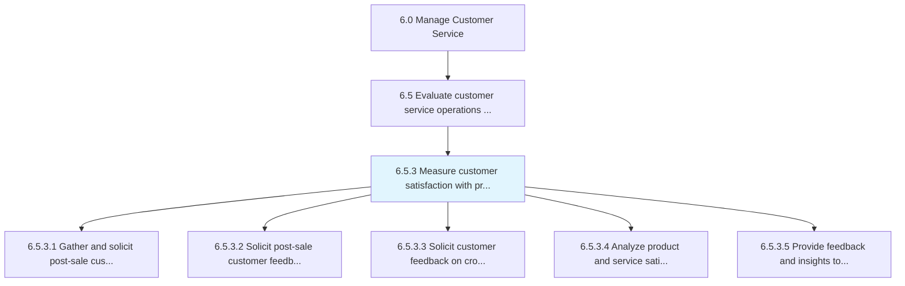
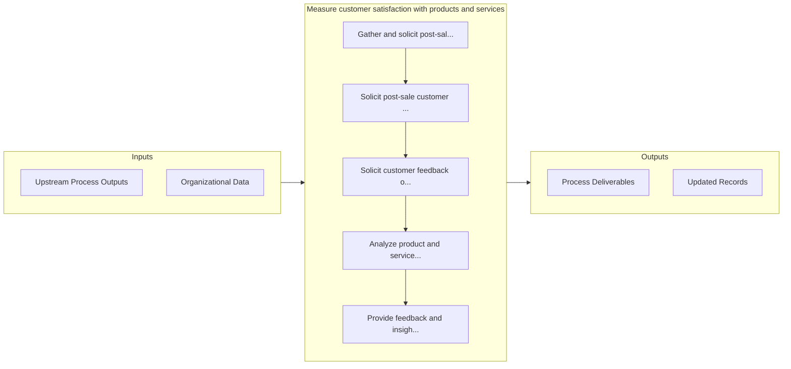

# Measure customer satisfaction with products and services

> Calculating satisfaction levels of customers with products/services.

## Overview

Process 6.5.3 is a core process that defines the specific procedures for measure customer satisfaction with products and services. 

Calculating satisfaction levels of customers with products/services. Obtain customer feedback on products/services, as well as the effectiveness of the advertising campaigns. Examine this information to reach meaningful conclusions, which could then be used to enhance the customer service operations.

## Process Hierarchy



## Key Statistics

| Metric | Value |
|--------|-------|
| APQC Code | 10403 |
| Hierarchy ID | 6.5.3 |
| Level | Process |
| Parent | [6.5](../) |
| Sub-Processes | 5 |


## GraphDL Semantic Structure

```
measure.CustomerSatisfaction.with.ProductsAndServices
```

| Component | Value | Description |
|-----------|-------|-------------|
| Verb | `measure` | Primary action |
| Object | `customer satisfaction` | Direct object |
| Preposition | `with` | Relationship |
| PrepObject | `products and services` | Indirect object |


## Process Flow



## Sub-Processes

| Process | Hierarchy ID | Description |
|---------|-------------|-------------|
| [Gather and solicit post-sale customer feedback on products and services](./GatherAndSolicitPostsaleCustomerFeedbackOnProductsAndServices) | 6.5.3.1 | Obtaining customer feedback/review on the quality and utility derived from the products/services aft |
| [Solicit post-sale customer feedback on ad effectiveness](./SolicitPostsaleCustomerFeedbackOnAdEffectiveness) | 6.5.3.2 | Assessing the influence of advertisements on purchasing behavior |
| [Solicit customer feedback on cross-channel experience](./SolicitCustomerFeedbackOnCrosschannelExperience) | 6.5.3.3 | Engaging with the customer to understand their cross-channel experience |
| [Analyze product and service satisfaction data and identify improvement opportunities](./AnalyzeProductAndServiceSatisfactionDataAndIdentifyImprovementOpportunities) | 6.5.3.4 | Assessing the information collected on customer satisfaction levels with products/services in order  |
| [Provide feedback and insights to appropriate teams (product design/development, marketing, manufacturing)](./ProvideFeedbackAndInsightsToAppropriateTeamsProductDesigndevelopmentMarketingManufacturing) | 6.5.3.5 | Providing feedback from customers on products/services to the product management team |


## Related Concepts

- [CustomerSatisfaction](/concepts/CustomerSatisfaction)
- [Products](/concepts/Products)
- [CustomerSatisfaction](/concepts/CustomerSatisfaction)
- [Services](/concepts/Services)


---

*Source: APQC PCF 10403 (6.5.3) - APQC*
