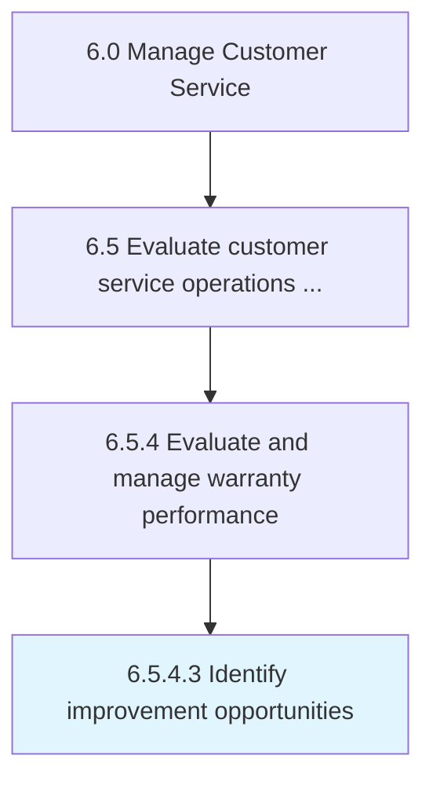

# Identify improvement opportunities

> Determining how warranties and warranty management can be made better and more efficient.

## Overview

Activity 6.5.4.3 is an activity within the Manage Customer Service framework. 

Determining how warranties and warranty management can be made better and more efficient.

## Process Hierarchy



## Key Statistics

| Metric | Value |
|--------|-------|
| APQC Code | 20119 |
| Hierarchy ID | 6.5.4.3 |
| Level | Activity |
| Parent | [6.5.4](../) |
| Sub-Processes | 0 |


## GraphDL Semantic Structure

```
identify.ImprovementOpportunities
```

| Component | Value | Description |
|-----------|-------|-------------|
| Verb | `identify` | Primary action |
| Object | `improvement opportunities` | Direct object |


## Related Concepts

- ImprovementOpportunities


---

*Source: APQC PCF 20119 (6.5.4.3) - APQC*
