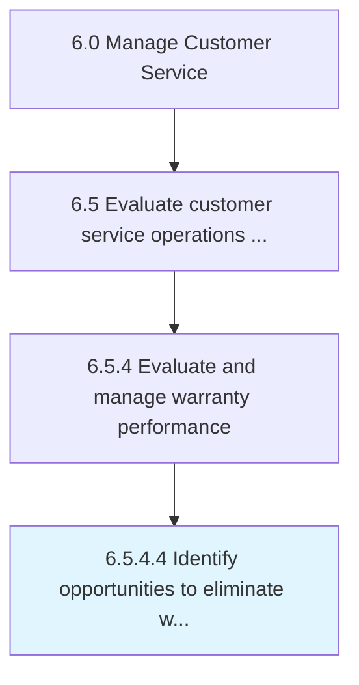

# Identify opportunities to eliminate warranty waste

> Finding ways to phase out unused or seldom used warranties.

## Overview

Activity 6.5.4.4 is an activity within the Manage Customer Service framework. 

Finding ways to phase out unused or seldom used warranties.

## Process Hierarchy



## Key Statistics

| Metric | Value |
|--------|-------|
| APQC Code | 12674 |
| Hierarchy ID | 6.5.4.4 |
| Level | Activity |
| Parent | [6.5.4](../) |
| Sub-Processes | 0 |


## GraphDL Semantic Structure

```
identify.Opportunities.to.EliminateWarrantyWaste
```

| Component | Value | Description |
|-----------|-------|-------------|
| Verb | `identify` | Primary action |
| Object | `opportunities` | Direct object |
| Preposition | `to` | Relationship |
| PrepObject | `eliminate warranty waste` | Indirect object |


## Related Concepts

- Opportunities
- EliminateWarrantyWaste


---

*Source: APQC PCF 12674 (6.5.4.4) - APQC*
