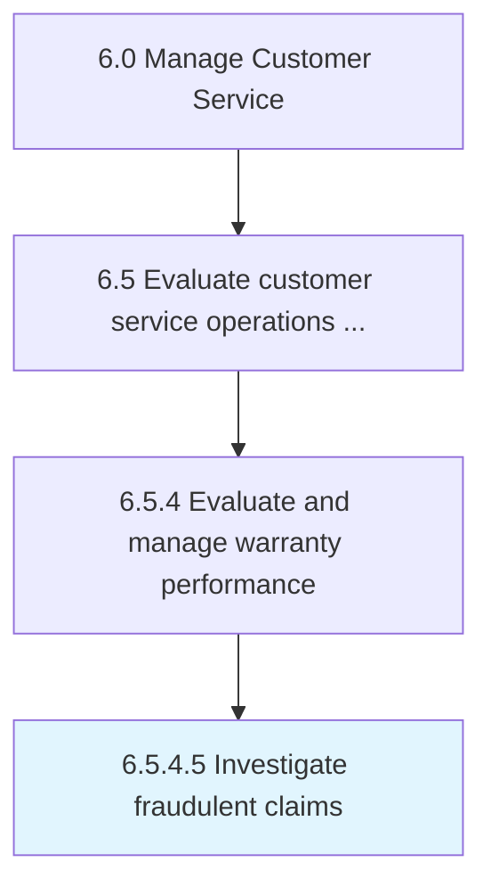

# Investigate fraudulent claims

> Reviewing and assessing claims that contain deliberately incorrect information or that have been submitted with the goal to deceive the system.

## Overview

Activity 6.5.4.5 is an activity within the Manage Customer Service framework. 

Reviewing and assessing claims that contain deliberately incorrect information or that have been submitted with the goal to deceive the system.

## Process Hierarchy



## Key Statistics

| Metric | Value |
|--------|-------|
| APQC Code | 20120 |
| Hierarchy ID | 6.5.4.5 |
| Level | Activity |
| Parent | [6.5.4](../) |
| Sub-Processes | 0 |


## GraphDL Semantic Structure

```
investigate.FraudulentClaims
```

| Component | Value | Description |
|-----------|-------|-------------|
| Verb | `investigate` | Primary action |
| Object | `fraudulent claims` | Direct object |


## Related Concepts

- [FraudulentClaims](/concepts/FraudulentClaims)


---

*Source: APQC PCF 20120 (6.5.4.5) - APQC*
