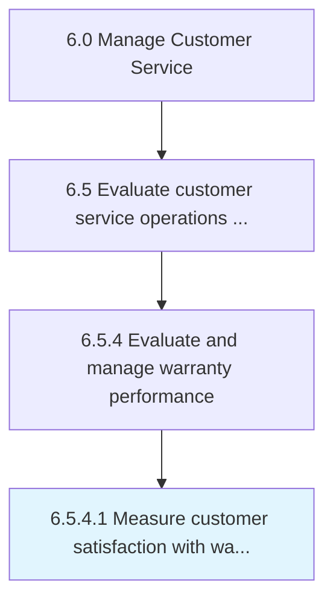

# Measure customer satisfaction with warranty handling and resolution

> Evaluating how satisfied customers are with how product warranties are managed and resolved.

## Overview

Activity 6.5.4.1 is an activity within the Manage Customer Service framework. 

Evaluating how satisfied customers are with how product warranties are managed and resolved.

## Process Hierarchy



## Key Statistics

| Metric | Value |
|--------|-------|
| APQC Code | 20118 |
| Hierarchy ID | 6.5.4.1 |
| Level | Activity |
| Parent | [6.5.4](../) |
| Sub-Processes | 0 |


## GraphDL Semantic Structure

```
measure.CustomerSatisfaction.with.WarrantyHandlingAndResolution
```

| Component | Value | Description |
|-----------|-------|-------------|
| Verb | `measure` | Primary action |
| Object | `customer satisfaction` | Direct object |
| Preposition | `with` | Relationship |
| PrepObject | `warranty handling and resolution` | Indirect object |


## Related Concepts

- [CustomerSatisfaction](/concepts/CustomerSatisfaction)
- [WarrantyHandling](/concepts/WarrantyHandling)
- [CustomerSatisfaction](/concepts/CustomerSatisfaction)
- [Resolution](/concepts/Resolution)


---

*Source: APQC PCF 20118 (6.5.4.1) - APQC*
