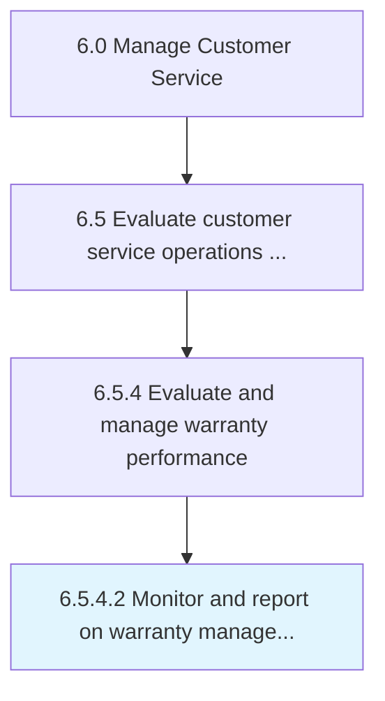

# Monitor and report on warranty management metrics

> Comparing warranties by using applicable metrics to see how they are handled and resolved.

## Overview

Activity 6.5.4.2 is an activity within the Manage Customer Service framework. 

Comparing warranties by using applicable metrics to see how they are handled and resolved. Develop and submit reports that summarize significant conclusions.

## Process Hierarchy



## Key Statistics

| Metric | Value |
|--------|-------|
| APQC Code | 12676 |
| Hierarchy ID | 6.5.4.2 |
| Level | Activity |
| Parent | [6.5.4](../) |
| Sub-Processes | 0 |


## GraphDL Semantic Structure

```
monitor.AndReport.on.WarrantyManagementMetrics
```

| Component | Value | Description |
|-----------|-------|-------------|
| Verb | `monitor` | Primary action |
| Object | `and report` | Direct object |
| Preposition | `on` | Relationship |
| PrepObject | `warranty management metrics` | Indirect object |


## Related Concepts

- [WarrantyManagementMetrics](/concepts/WarrantyManagementMetrics)
- [WarrantyManagementMetrics](/concepts/WarrantyManagementMetrics)


---

*Source: APQC PCF 12676 (6.5.4.2) - APQC*
