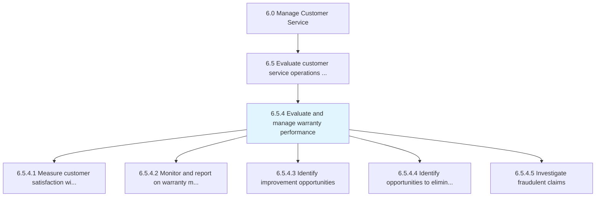
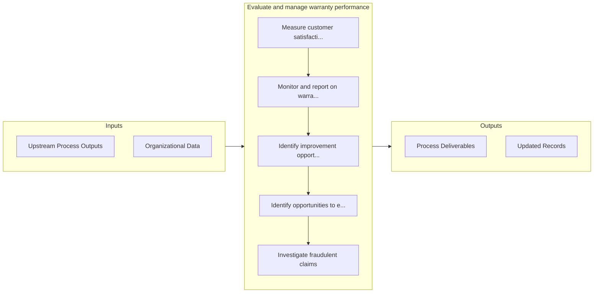

# Evaluate and manage warranty performance

> Assessing the cost and effectiveness of warranties.

## Overview

Process 6.5.4 is a core process that defines the specific procedures for evaluate and manage warranty performance. 

Assessing the cost and effectiveness of warranties.

## Process Hierarchy



## Key Statistics

| Metric | Value |
|--------|-------|
| APQC Code | 12672 |
| Hierarchy ID | 6.5.4 |
| Level | Process |
| Parent | [6.5](../) |
| Sub-Processes | 5 |


## GraphDL Semantic Structure

```graphdl
evaluate.AndManageWarrantyPerformance
```

| Component | Value | Description |
|-----------|-------|-------------|
| Verb | `evaluate` | Primary action |
| Object | `and manage warranty performance` | Direct object |


## Process Flow



## Sub-Processes

| Process | Hierarchy ID | Description |
|---------|-------------|-------------|
| [Measure customer satisfaction with warranty handling and resolution](./MeasureCustomerSatisfactionWithWarrantyHandlingAndResolution) | 6.5.4.1 | Evaluating how satisfied customers are with how product warranties are managed and resolved |
| [Monitor and report on warranty management metrics](./MonitorAndReportOnWarrantyManagementMetrics) | 6.5.4.2 | Comparing warranties by using applicable metrics to see how they are handled and resolved |
| [Identify improvement opportunities](./IdentifyImprovementOpportunities) | 6.5.4.3 | Determining how warranties and warranty management can be made better and more efficient |
| [Identify opportunities to eliminate warranty waste](./IdentifyOpportunitiesToEliminateWarrantyWaste) | 6.5.4.4 | Finding ways to phase out unused or seldom used warranties |
| [Investigate fraudulent claims](./InvestigateFraudulentClaims) | 6.5.4.5 | Reviewing and assessing claims that contain deliberately incorrect information or that have been sub |


## Related Concepts

- WarrantyPerformance
- WarrantyPerformance


---

*Source: APQC PCF 12672 (6.5.4) - APQC*
