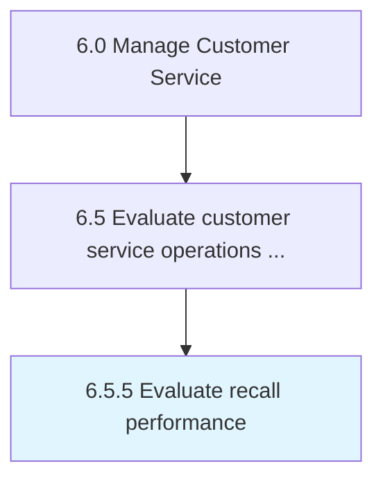

# Evaluate recall performance

> Reviewing customer service feedback to identify areas in which improvements can be made.

## Overview

Process 6.5.5 is a core process that defines the specific procedures for evaluate recall performance. 

Reviewing customer service feedback to identify areas in which improvements can be made. Engage with management to discuss issues.

## Process Hierarchy



## Key Statistics

| Metric | Value |
|--------|-------|
| APQC Code | 20121 |
| Hierarchy ID | 6.5.5 |
| Level | Process |
| Parent | [6.5](../) |
| Sub-Processes | 0 |


## GraphDL Semantic Structure

```
evaluate.RecallPerformance
```

| Component | Value | Description |
|-----------|-------|-------------|
| Verb | `evaluate` | Primary action |
| Object | `recall performance` | Direct object |


## Related Concepts

- RecallPerformance


---

*Source: APQC PCF 20121 (6.5.5) - APQC*
