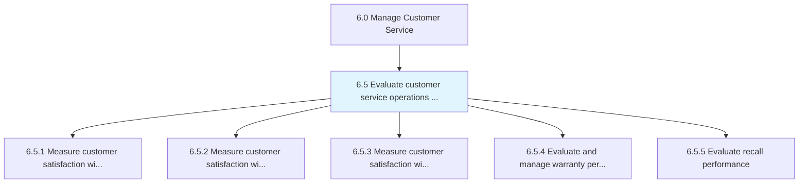
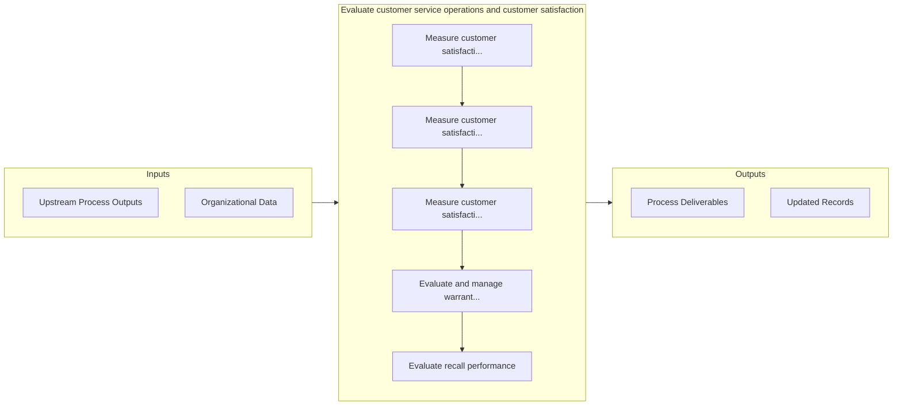

# Evaluate customer service operations and customer satisfaction

> Calculating and assessing the operational activities of the customer service function.

## Overview

Group 6.5 is a process group within APQC Category 6.0 (Manage Customer Service). 

Calculating and assessing the operational activities of the customer service function. Evaluation is achieved through the customer requests/inquiries handling process, the customer complaint handling process, and product and services quality. Examine activities to ensure high levels of customer service.

## Process Hierarchy



## Key Statistics

| Metric | Value |
|--------|-------|
| APQC Code | 20595 |
| Hierarchy ID | 6.5 |
| Level | Group |
| Parent | [6](../) |
| Sub-Processes | 5 |


## GraphDL Semantic Structure

```graphdl
evaluate.CustomerServiceOperationsAndCustomerSatisfaction
```

| Component | Value | Description |
|-----------|-------|-------------|
| Verb | `evaluate` | Primary action |
| Object | `customer service operations and customer satisfaction` | Direct object |


## Process Flow



## Sub-Processes

| Process | Hierarchy ID | Description |
|---------|-------------|-------------|
| [Measure customer satisfaction with customer problems, requests, and inquiries handling](./6.5.1-MeasureCustomerSatisfactionCustomer/) | 6.5.1 | Calculating satisfaction levels of customers by effectively evaluating the process of handling reque |
| [Measure customer satisfaction with customer- complaint handling and resolution](./6.5.2-MeasureCustomerSatisfactionCustomer/) | 6.5.2 | Measuring the satisfaction level of customers as pertains to how their complaints are handled and re |
| [Measure customer satisfaction with products and services](./6.5.3-MeasureCustomerSatisfactionProducts/) | 6.5.3 | Calculating satisfaction levels of customers with products/services |
| [Evaluate and manage warranty performance](./6.5.4-EvaluateManageWarrantyPerformance/) | 6.5.4 | Assessing the cost and effectiveness of warranties |
| [Evaluate recall performance](./EvaluateRecallPerformance) | 6.5.5 | Reviewing customer service feedback to identify areas in which improvements can be made |


## Related Concepts

- CustomerServiceOperationsSatisfaction
- CustomerSatisfaction


---

*Source: APQC PCF 20595 (6.5) - APQC*
