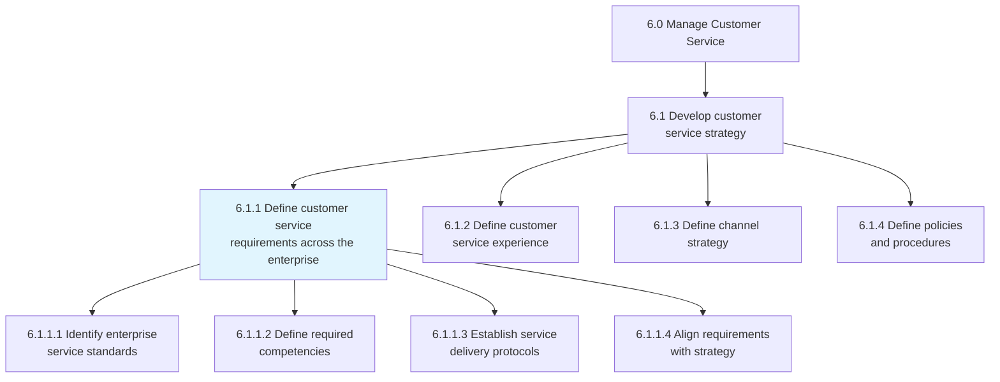
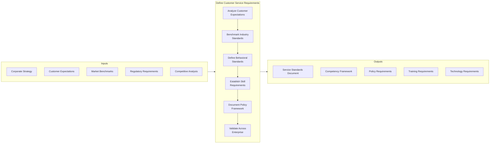
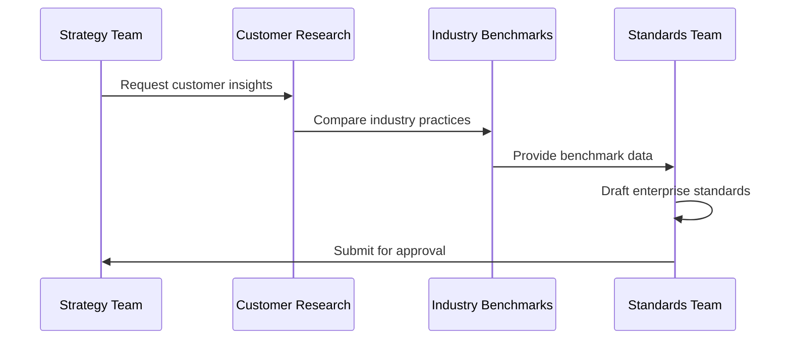
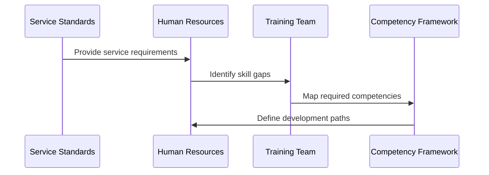
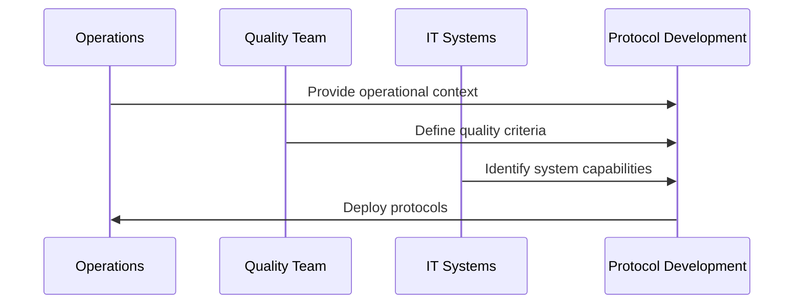
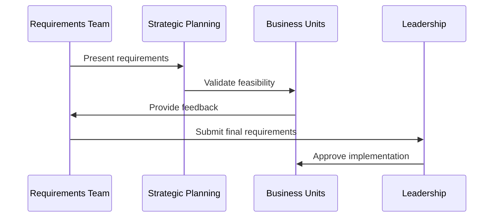
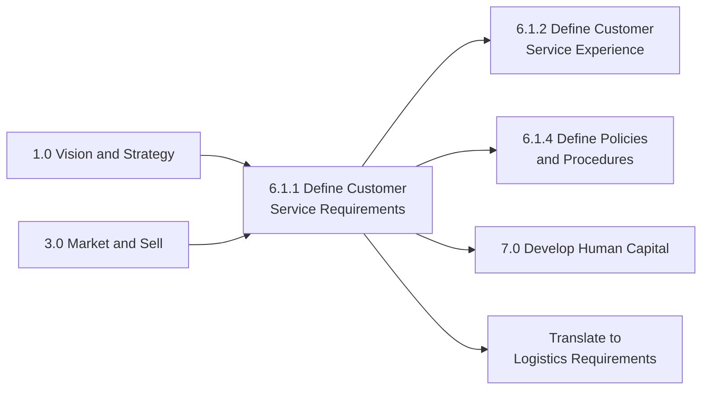

# Define customer service requirements across the enterprise

> Defining a set of behaviors, skills, and policies needed to provide customer service effectively across the enterprise.

## Overview

Define customer service requirements across the enterprise is a foundational process (6.1.1) within the customer service strategy group. This process establishes the behavioral standards, skill requirements, and policy frameworks that govern how customer service is delivered across all organizational units and channels. It ensures consistency in service delivery while accommodating the unique needs of different customer segments and business lines.

This process translates organizational values and customer expectations into actionable requirements that can be operationalized across the enterprise. It serves as the foundation for workforce planning, training programs, technology investments, and performance management systems within the customer service function.

## Process Hierarchy



## Key Statistics

| Metric | Value |
|--------|-------|
| APQC Code | 20086 |
| Hierarchy ID | 6.1.1 |
| Level | Process |
| Category | [Manage Customer Service](/processes/06-CustomerService) |
| Parent Group | 6.1 Develop customer service strategy |

## Process Flow



## GraphDL Semantic Structure

```
define.CustomerServiceRequirements.across.Enterprise
```

| Component | Value | Description |
|-----------|-------|-------------|
| Verb | `define` | Establishing and documenting |
| Object | `CustomerServiceRequirements` | Behaviors, skills, and policies |
| Preposition | `across` | Spanning all organizational units |
| PrepObject | `Enterprise` | The entire organization |

## Activities

### 6.1.1.1 - Identify enterprise service standards

Determining the baseline service standards that apply across all customer touchpoints and organizational units. Standards cover response times, resolution targets, and interaction quality.



**Tasks:**
- `analyze.CustomerExpectations` - Understand customer service preferences
- `benchmark.IndustryStandards` - Compare with industry best practices
- `draft.EnterpriseStandards` - Create standard documentation
- `validate.StandardsFeasibility` - Assess operational viability

### 6.1.1.2 - Define required competencies

Establishing the skills, knowledge, and behavioral attributes required for customer service personnel across different roles and channels.



**Tasks:**
- `identify.CoreCompetencies` - Define baseline skills for all roles
- `map.RoleSpecificSkills` - Determine channel-specific requirements
- `establish.BehavioralStandards` - Set interaction quality expectations
- `create.CompetencyFramework` - Document comprehensive requirements

### 6.1.1.3 - Establish service delivery protocols

Creating standardized procedures for handling customer interactions across all channels and scenarios.



**Tasks:**
- `design.InteractionProtocols` - Create standard interaction flows
- `define.EscalationProcedures` - Establish escalation paths
- `document.ResolutionGuidelines` - Specify resolution approaches
- `standardize.QualityCheckpoints` - Define quality control steps

### 6.1.1.4 - Align requirements with strategy

Ensuring customer service requirements support broader organizational strategy and can be executed effectively across the enterprise.



**Tasks:**
- `align.RequirementsToStrategy` - Connect to business objectives
- `validate.CrossFunctional` - Confirm enterprise-wide applicability
- `assess.ResourceImplications` - Evaluate implementation needs
- `obtain.ExecutiveApproval` - Secure leadership endorsement

## RACI Matrix

| Activity | Responsible | Accountable | Consulted | Informed |
|----------|-------------|-------------|-----------|----------|
| Identify enterprise standards | CX Standards Team | Customer Service Director | Marketing, Operations | All departments |
| Define required competencies | HR, CX Team | VP Human Resources | Training, Operations | Workforce |
| Establish delivery protocols | Operations Manager | Customer Service Director | IT, Quality | All agents |
| Align requirements with strategy | Strategy Team | Chief Customer Officer | Executive Team | All stakeholders |
| Validate across enterprise | CX Manager | Customer Service Director | Business Units | All departments |
| Document requirements | Documentation Team | CX Manager | Legal, Compliance | All stakeholders |

## Related Departments

- [Customer Service](/departments/CustomerService) - Primary ownership of requirements
- [Human Resources](/departments/HR) - Competency and training alignment
- [Operations](/departments/Operations) - Operational feasibility validation
- [Strategy](/departments/Strategy) - Strategic alignment
- [Information Technology](/departments/IT) - Technology requirements
- [Legal](/departments/Legal) - Regulatory compliance review

## Related Occupations

- [Customer Service Managers](/occupations/CustomerServiceManagers) - Requirements development lead
- [Human Resources Specialists](/occupations/HRSpecialists) - Competency framework development
- [Training and Development Specialists](/occupations/TrainingSpecialists) - Training requirements
- [Management Analysts](/occupations/ManagementAnalysts) - Process design
- [Quality Control Analysts](/occupations/QualityControlAnalysts) - Standards development

## Industry Variations

### Aerospace and Defense

Aerospace and defense organizations define service requirements around technical expertise, security clearance levels, and long-term customer relationship management. Requirements emphasize regulatory compliance and documentation standards.

**Industry-Specific Activities:**
- Define technical certification requirements for support staff
- Establish security clearance protocols
- Create requirements for government contract compliance
- Document ITAR/EAR compliance procedures

### Banking

Banking service requirements focus on regulatory compliance, security protocols, and multi-channel consistency. Requirements must address consumer protection regulations and fraud prevention.

**Industry-Specific Activities:**
- Define regulatory compliance requirements (CFPB, BSA/AML)
- Establish security and authentication protocols
- Create requirements for dispute resolution procedures
- Document privacy and data protection standards

### Healthcare Provider

Healthcare organizations define service requirements around patient privacy, clinical knowledge, and care coordination. Requirements emphasize HIPAA compliance and empathetic communication.

**Industry-Specific Activities:**
- Establish HIPAA compliance requirements
- Define clinical knowledge expectations for staff
- Create requirements for patient privacy protection
- Document care coordination protocols

### Retail

Retail service requirements span in-store and digital channels with emphasis on product knowledge, returns handling, and omnichannel consistency.

**Industry-Specific Activities:**
- Define product knowledge requirements by category
- Establish omnichannel service consistency standards
- Create requirements for returns and exchanges
- Document loyalty program service protocols

### City Government

Government service requirements focus on accessibility, equity, and transparency. Requirements must address ADA compliance and multilingual service capabilities.

**Industry-Specific Activities:**
- Define accessibility and ADA compliance requirements
- Establish multilingual service capabilities
- Create requirements for public records requests
- Document constituent privacy protections

### Education

Educational institutions define service requirements around student success, stakeholder support, and regulatory compliance with education-specific regulations.

**Industry-Specific Activities:**
- Define student and stakeholder support requirements
- Establish FERPA compliance protocols
- Create requirements for academic support services
- Document enrollment and registration procedures

## Sub-Processes

| Process | Code | Description |
|---------|------|-------------|
| Identify enterprise service standards | 6.1.1.1 | Establishing baseline service standards |
| Define required competencies | 6.1.1.2 | Mapping skill and behavioral requirements |
| Establish service delivery protocols | 6.1.1.3 | Creating standardized procedures |
| Align requirements with strategy | 6.1.1.4 | Connecting to organizational objectives |

## Related Processes



## Metrics & KPIs

| Metric | Description | Target |
|--------|-------------|--------|
| Requirements Coverage | Percentage of operations covered by documented requirements | 100% |
| Competency Alignment | Staff meeting defined competency requirements | >90% |
| Standards Compliance | Adherence to enterprise service standards | >95% |
| Cross-Unit Consistency | Variation in service delivery across units | <10% |
| Requirements Currency | Age of requirements documentation | <12 months |
| Stakeholder Approval | Business units accepting requirements | 100% |

---

*Source: APQC PCF 20086 (6.1.1) - Cross-Industry*
