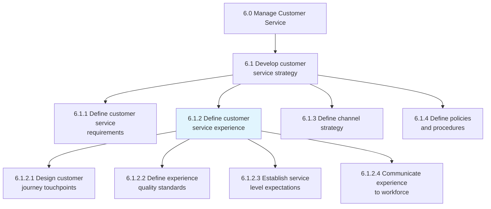
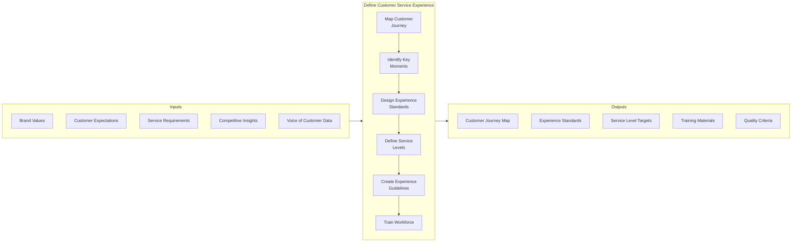
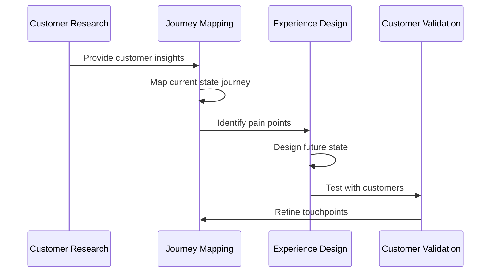
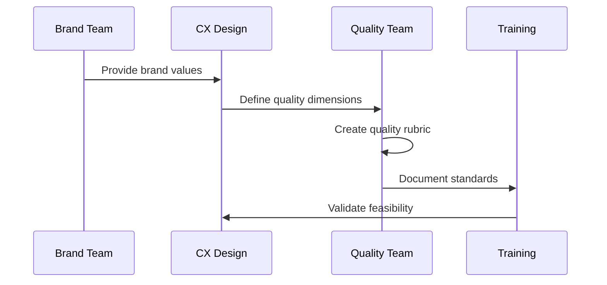
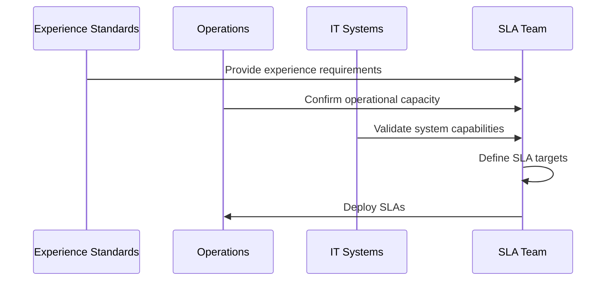
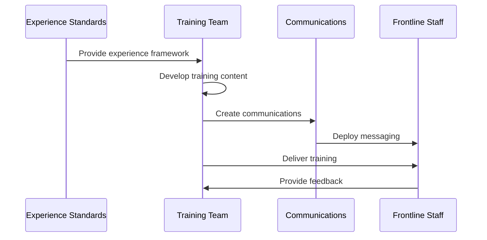
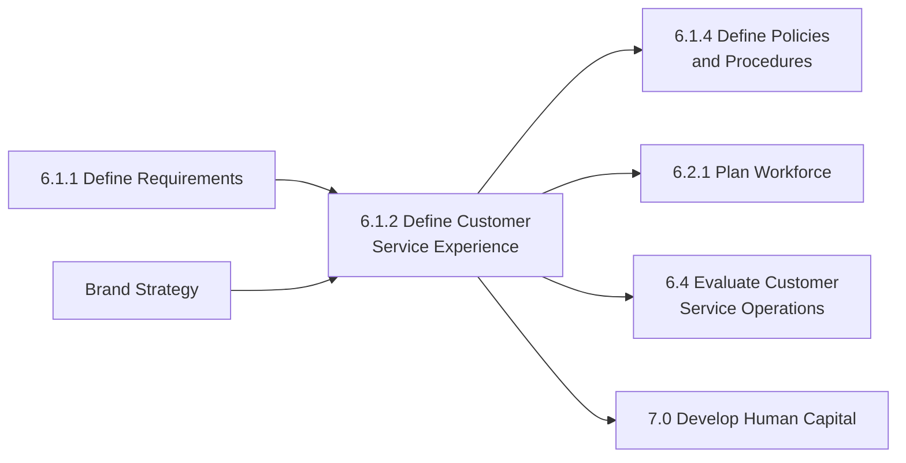

# Define customer service experience

> Communicating to the customer service resources what is expected when engaging the customer. Relate service level expectations to the workforce. Ensure positive customer experience.

## Overview

Define customer service experience is a strategic process (6.1.2) that translates organizational service vision into actionable experience standards for frontline teams. This process establishes the emotional and functional expectations for every customer interaction, ensuring that service delivery aligns with brand values and customer expectations.

This process bridges the gap between strategic customer experience objectives and operational service delivery. It creates a shared understanding across the organization of what excellent customer service looks like, feels like, and delivers. The resulting experience framework guides agent behavior, quality monitoring, training development, and performance management.

## Process Hierarchy



## Key Statistics

| Metric | Value |
|--------|-------|
| APQC Code | 20087 |
| Hierarchy ID | 6.1.2 |
| Level | Process |
| Category | [Manage Customer Service](/processes/06-CustomerService) |
| Parent Group | 6.1 Develop customer service strategy |

## Process Flow



## GraphDL Semantic Structure

```
define.CustomerServiceExperience
```

| Component | Value | Description |
|-----------|-------|-------------|
| Verb | `define` | Establishing and articulating |
| Object | `CustomerServiceExperience` | The complete service encounter |
| Preposition | - | Not specified in base form |
| PrepObject | - | Not specified in base form |

## Activities

### 6.1.2.1 - Design customer journey touchpoints

Mapping all points of customer interaction within the service experience and designing optimal engagement at each touchpoint.



**Tasks:**
- `map.CustomerJourney` - Document all interaction points
- `identify.CriticalTouchpoints` - Highlight high-impact moments
- `design.TouchpointExperiences` - Create optimal interactions
- `validate.JourneyDesign` - Test with real customers

### 6.1.2.2 - Define experience quality standards

Establishing specific quality criteria that define excellent customer service experiences across all channels and interactions.



**Tasks:**
- `define.ExperienceQualityDimensions` - Identify quality components
- `create.QualityRubric` - Develop scoring criteria
- `establish.BenchmarkStandards` - Set performance targets
- `document.QualityGuidelines` - Create reference materials

### 6.1.2.3 - Establish service level expectations

Setting specific, measurable service level targets that support the desired customer experience.



**Tasks:**
- `define.ResponseTimeTargets` - Set timing expectations
- `establish.ResolutionTargets` - Define resolution metrics
- `create.ChannelSpecificSLAs` - Customize by channel
- `align.SLAsWithExperience` - Connect to experience goals

### 6.1.2.4 - Communicate experience to workforce

Ensuring all customer-facing staff understand and can deliver the defined customer service experience.



**Tasks:**
- `develop.ExperienceTraining` - Create learning programs
- `communicate.ExperienceVision` - Share with all staff
- `reinforce.ExperienceExpectations` - Ongoing communication
- `gather.WorkforceFeedback` - Collect frontline input

## RACI Matrix

| Activity | Responsible | Accountable | Consulted | Informed |
|----------|-------------|-------------|-----------|----------|
| Design journey touchpoints | CX Designer | Customer Service Director | Marketing, Sales | All departments |
| Define quality standards | Quality Manager | CX Director | Operations, HR | Workforce |
| Establish service level expectations | Operations Manager | Customer Service Director | IT, Finance | All agents |
| Communicate to workforce | Training Manager | HR Director | CX Team | All employees |
| Validate experience design | Customer Research | CX Director | Customers | Leadership |
| Monitor experience delivery | Quality Team | Operations Manager | Agents | Leadership |

## Related Departments

- [Customer Service](/departments/CustomerService) - Experience delivery ownership
- [Marketing](/departments/Marketing) - Brand alignment and journey mapping
- [Human Resources](/departments/HR) - Training and development
- [Quality Assurance](/departments/Quality) - Standards and monitoring
- [Information Technology](/departments/IT) - Technology enablement
- [Operations](/departments/Operations) - Operational execution

## Related Occupations

- [Customer Experience Managers](/occupations/CXManagers) - Experience design leadership
- [Customer Service Managers](/occupations/CustomerServiceManagers) - Experience execution
- [Training Specialists](/occupations/TrainingSpecialists) - Workforce enablement
- [Quality Assurance Analysts](/occupations/QualityAnalysts) - Quality monitoring
- [UX Designers](/occupations/UXDesigners) - Journey design

## Industry Variations

### Aerospace and Defense

Aerospace customer experience emphasizes technical expertise, long-term relationship building, and proactive support. Experience design focuses on reliability, trust, and specialized knowledge.

**Industry-Specific Activities:**
- Design technical support experiences
- Define aftermarket service touchpoints
- Create fleet support experience standards
- Establish government customer protocols

### Banking

Banking experience design balances security with convenience. Focus on building trust through transparency, protection, and seamless multi-channel access.

**Industry-Specific Activities:**
- Design secure authentication experiences
- Define branch, phone, and digital touchpoints
- Create high-net-worth customer experiences
- Establish dispute resolution journey

### Healthcare Provider

Healthcare experience design prioritizes empathy, clinical competence, and care coordination. Experiences must address patient anxiety and health literacy challenges.

**Industry-Specific Activities:**
- Design patient communication experiences
- Define caregiver touchpoints
- Create end-of-life care experiences
- Establish patient portal journey

### Retail

Retail experience design creates seamless omnichannel journeys. Focus on convenience, personalization, and brand consistency across in-store and digital channels.

**Industry-Specific Activities:**
- Design in-store service experiences
- Define returns and exchange touchpoints
- Create loyalty program experiences
- Establish e-commerce support journey

### City Government

Government experience design emphasizes accessibility, equity, and efficiency. Experiences must serve diverse populations with varying needs and capabilities.

**Industry-Specific Activities:**
- Design accessible service experiences
- Define constituent engagement touchpoints
- Create emergency response experiences
- Establish permit and license journeys

### Airline

Airline experience design addresses high-stakes, time-sensitive situations. Focus on information transparency, empathy during disruptions, and loyalty recognition.

**Industry-Specific Activities:**
- Design irregular operations experiences
- Define airport touchpoints
- Create premium traveler experiences
- Establish rebooking and compensation journeys

## Sub-Processes

| Process | Code | Description |
|---------|------|-------------|
| Design customer journey touchpoints | 6.1.2.1 | Mapping interaction points |
| Define experience quality standards | 6.1.2.2 | Establishing quality criteria |
| Establish service level expectations | 6.1.2.3 | Setting measurable targets |
| Communicate experience to workforce | 6.1.2.4 | Enabling frontline delivery |

## Related Processes



## Metrics & KPIs

| Metric | Description | Target |
|--------|-------------|--------|
| Customer Satisfaction (CSAT) | Post-interaction satisfaction rating | >85% |
| Customer Effort Score (CES) | Ease of service experience | <2.0 |
| Net Promoter Score (NPS) | Likelihood to recommend | >50 |
| Experience Consistency | Variation across channels/agents | <10% |
| Workforce Adoption | Staff demonstrating experience standards | >95% |
| Journey Completion Rate | Customers completing intended journey | >80% |
| Emotion Score | Positive sentiment in interactions | >75% |
| Training Completion | Staff completing experience training | 100% |

---

*Source: APQC PCF 20087 (6.1.2) - Cross-Industry*
