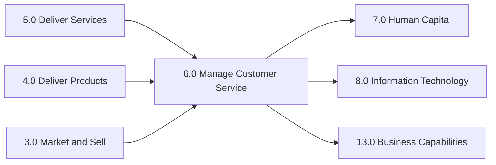

# Manage Customer Service

> Managing customers before and after the delivery of services. This includes developing and planning customer service practices with an eye on steering processes relating to inquiries after sales, feedback, warranties, and recalls.

## Overview

APQC Category 6.0 - Manage Customer Service encompasses all activities related to planning, executing, and evaluating customer service operations. This category focuses on establishing customer service requirements, defining service experiences, creating policies and procedures, and managing customer interactions across all touchpoints. Organizations use these processes to ensure consistent, high-quality customer experiences that drive satisfaction, loyalty, and retention.

The customer service function serves as the primary interface between the organization and its customers post-sale, handling inquiries, complaints, warranties, recalls, and feedback. Effective customer service directly impacts customer lifetime value, brand reputation, and competitive positioning.

## Process Hierarchy

```mermaid
graph TD
    C6["6.0 Manage Customer Service"] --> G61["6.1 Develop customer service strategy"]
    C6 --> G62["6.2 Plan and manage customer<br/>service contacts"]
    C6 --> G63["6.3 Manage customer service<br/>operations"]
    C6 --> G64["6.4 Evaluate customer service<br/>operations"]

    G61 --> P611["6.1.1 Define customer service requirements<br/>across the enterprise"]
    G61 --> P612["6.1.2 Define customer service experience"]
    G61 --> P613["6.1.3 Define and manage customer<br/>service channel strategy"]
    G61 --> P614["6.1.4 Define customer service policies<br/>and procedures"]
    G61 --> P615["6.1.5 Establish target service levels"]

    G62 --> P621["6.2.1 Plan and manage customer<br/>service work force"]
    G62 --> P622["6.2.2 Manage customer service<br/>problems, requests, and inquiries"]
    G62 --> P623["6.2.3 Manage customer complaints"]

    G63 --> P631["6.3.1 Execute customer service<br/>operations"]
    G63 --> P632["6.3.2 Manage warranties and recalls"]

    G64 --> P641["6.4.1 Measure customer satisfaction"]
    G64 --> P642["6.4.2 Measure customer service<br/>operations performance"]
```



## Key Statistics

| Metric | Value |
|--------|-------|
| APQC Code | 20085 |
| Hierarchy ID | 6.0 |
| Level | Category |
| Process Groups | 4 |
| Total Processes | 50+ |

## Processes in this Category

### 6.1 Develop customer service strategy

Defining a plan that removes customer obstacles by gathering operational insight and competitive insight, as well as improving soft skills and forward resolution for employees.

- [Define customer service requirements across the enterprise](./Requirements.mdx) - Process 6.1.1
- [Define customer service experience](./ServiceExperience.mdx) - Process 6.1.2
- [Define customer service policies and procedures](./Policies.mdx) - Process 6.1.4
- [Translate customer service requirements into logistics requirements](./LogisticsRequirements.mdx) - Supporting Process

### 6.2 Plan and manage customer service contacts

Planning and administering workforce operations for customer service provision by taking care of customer service requests/inquiries and complaints.

### 6.3 Manage customer service operations

Executing day-to-day customer service activities including handling service requests, managing warranties, and processing recalls.

### 6.4 Evaluate customer service operations

Calculating and assessing the operational activities of the customer service function through customer feedback, quality metrics, and satisfaction surveys.

## Core Process

- [Manage Customer Service](./ServiceManagement.mdx) - Category 6.0 Overview

## GraphDL Semantic Structure

```graphdl
manage.CustomerService
```

| Component | Value | Description |
|-----------|-------|-------------|
| Verb | `manage` | Orchestrating and overseeing |
| Object | `CustomerService` | All customer-facing support operations |
| Preposition | - | Not applicable at category level |
| PrepObject | - | Not applicable at category level |

## Related Categories



## Industry Variations

| Industry | Key Focus | Terminology |
|----------|-----------|-------------|
| Retail | In-store and online support | Customer Care |
| Banking | Account services, dispute resolution | Client Services |
| Healthcare | Patient support, billing inquiries | Patient Services |
| Airline | Reservations, baggage, delays | Passenger Services |
| City Government | Constituent engagement | Constituent Services |
| Education | Student and stakeholder support | Student Services |

## Metrics & KPIs

| Metric | Description | Target |
|--------|-------------|--------|
| Customer Satisfaction Score (CSAT) | Survey-based satisfaction rating | >85% |
| Net Promoter Score (NPS) | Likelihood to recommend | >50 |
| First Contact Resolution (FCR) | Issues resolved on first contact | >75% |
| Average Handle Time (AHT) | Average time per interaction | Varies by channel |
| Customer Effort Score (CES) | Ease of resolution for customer | <2.0 |

---

*Source: APQC PCF Category 6.0 - Cross-Industry*
