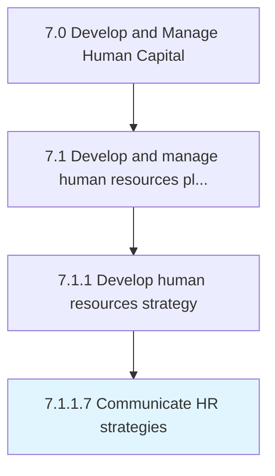

# Communicate HR strategies

> Conveying the strategies of HR function to employees and management.

## Overview

Activity 7.1.1.7 is an activity within the Develop and Manage Human Capital framework. 

Conveying the strategies of HR function to employees and management. Effectively explain the vision, plans, and anticipated benefits of the HR strategy employees, as well as the public. Develop statements and messages that are easy to read, informative, and relevant to the audience.

## Process Hierarchy



## Key Statistics

| Metric | Value |
|--------|-------|
| APQC Code | 10422 |
| Hierarchy ID | 7.1.1.7 |
| Level | Activity |
| Parent | [7.1.1](../) |
| Sub-Processes | 0 |


## GraphDL Semantic Structure

```
communicate.HRStrategies
```

| Component | Value | Description |
|-----------|-------|-------------|
| Verb | `communicate` | Primary action |
| Object | `HR strategies` | Direct object |


## Related Concepts

- HRStrategies


---

*Source: APQC PCF 10422 (7.1.1.7) - APQC*
