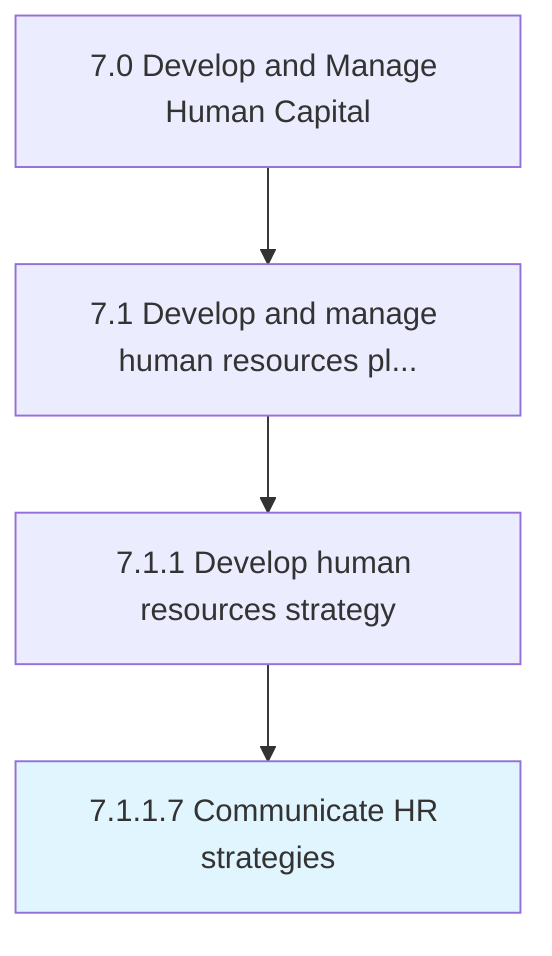
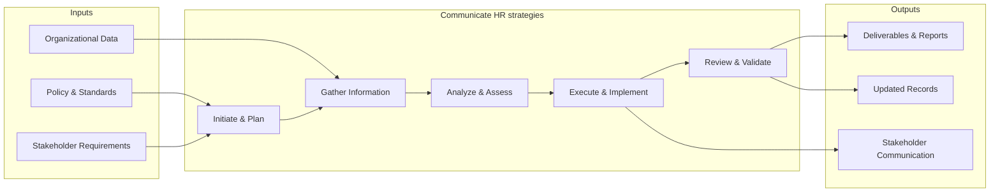

# Communicate HR strategies

> Conveying the strategies of HR function to employees and management.

## Overview

Activity 7.1.1.7 is an activity within the Develop and Manage Human Capital framework. 

Conveying the strategies of HR function to employees and management. Effectively explain the vision, plans, and anticipated benefits of the HR strategy employees, as well as the public. Develop statements and messages that are easy to read, informative, and relevant to the audience.

This process ensures effective communication of h r strategies across all organizational levels. It involves developing communication strategies, selecting appropriate channels, crafting targeted messaging, and measuring communication effectiveness to ensure stakeholder alignment and engagement.

## Process Hierarchy



## Key Statistics

| Metric | Value |
|--------|-------|
| APQC Code | 10422 |
| Hierarchy ID | 7.1.1.7 |
| Level | Activity |
| Parent | [7.1.1](../) |
| Sub-Processes | 0 |


## GraphDL Semantic Structure

```graphdl
communicate.HRStrategies
```

| Component | Value | Description |
|-----------|-------|-------------|
| Verb | `communicate` | Primary action |
| Object | `HR strategies` | Direct object |


## Related Concepts

- HRStrategies


## Process Flow



## RACI Matrix

| Activity | Responsible | Accountable | Consulted | Informed |
|----------|------------|-------------|-----------|----------|
| Define HR strategy | HR Director | CHRO | C-Suite | All Employees |
| Allocate HR budget | HR Director | CFO | Finance | Department Heads |
| Design org structure | HR Business Partner | CHRO | Department Heads | Employees |

## Related Occupations

- [Human Resources Managers](/occupations/Management/HumanResourcesManagers)
- [Compensation and Benefits Managers](/occupations/Management/CompensationAndBenefitsManagers)
- [Training and Development Managers](/occupations/Management/TrainingAndDevelopmentManagers)
- [Chief Executives](/occupations/Management/ChiefExecutives)
- [Management Analysts](/occupations/Business/Operations/ManagementAnalysts)

## Related Departments

- Human Resources
- Executive Leadership
- Finance

## Industry Variations

### Healthcare

Must account for clinical credentialing requirements, shift-based workforce models, and strict regulatory compliance (HIPAA, OSHA) when developing HR strategy.

### Technology

Focuses on rapid scaling, competitive talent markets, stock-based compensation strategies, and remote-first workforce planning.

### Manufacturing

Emphasizes union workforce considerations, safety certifications, skilled trade pipelines, and shift scheduling across multiple plant locations.

## KPIs & Metrics

| Metric | Description | Target |
|--------|-------------|--------|
| HR Cost per Employee | Total HR department cost divided by headcount | < $1,500/employee |
| HR-to-Employee Ratio | Number of HR FTEs per 100 employees | 1.0-1.4 per 100 |
| Strategic Alignment Score | Degree of HR strategy alignment with business objectives | > 80% |
| Workforce Plan Accuracy | Accuracy of headcount and skills forecasting | > 90% |

---

*Source: APQC PCF 10422 (7.1.1.7) - APQC*
