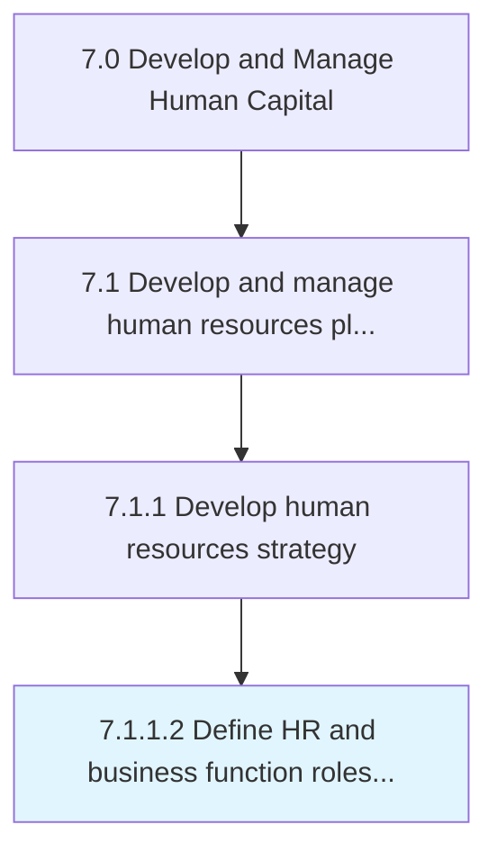

# Define HR and business function roles and accountability

> Outlining the charge and duty of the HR function by defining its responsibility areas, as well as ensuring its accountability.

## Overview

Activity 7.1.1.2 is an activity within the Develop and Manage Human Capital framework. 

Outlining the charge and duty of the HR function by defining its responsibility areas, as well as ensuring its accountability. Establish the HR function by laying out the roles and responsibilities for this function and the rules and regulations guiding HR. Define the goals and objectives of the HR, as well as a mission and vision for this function. Create a mechanism involving a set of policies, code of conduct, and institutional procedure to ensure HR accountability.

## Process Hierarchy



## Key Statistics

| Metric | Value |
|--------|-------|
| APQC Code | 10419 |
| Hierarchy ID | 7.1.1.2 |
| Level | Activity |
| Parent | [7.1.1](../) |
| Sub-Processes | 0 |


## GraphDL Semantic Structure

```
define.HRAndBusinessFunctionRolesAndAccountability
```

| Component | Value | Description |
|-----------|-------|-------------|
| Verb | `define` | Primary action |
| Object | `HR and business function roles and accountability` | Direct object |


## Related Concepts

- HRFunctionRoles
- Accountability
- BusinessFunctionRoles
- Accountability


---

*Source: APQC PCF 10419 (7.1.1.2) - APQC*
