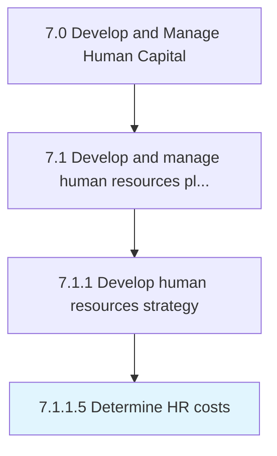

# Determine HR costs

> Ascertaining the costs and expenses of the HR function.

## Overview

Activity 7.1.1.5 is an activity within the Develop and Manage Human Capital framework. 

Ascertaining the costs and expenses of the HR function. Identify and report HR investments using, for example, a cost approach or a present value of future earnings approach.

## Process Hierarchy



## Key Statistics

| Metric | Value |
|--------|-------|
| APQC Code | 10420 |
| Hierarchy ID | 7.1.1.5 |
| Level | Activity |
| Parent | [7.1.1](../) |
| Sub-Processes | 0 |


## GraphDL Semantic Structure

```
determine.HRCosts
```

| Component | Value | Description |
|-----------|-------|-------------|
| Verb | `determine` | Primary action |
| Object | `HR costs` | Direct object |


## Related Concepts

- HRCosts


---

*Source: APQC PCF 10420 (7.1.1.5) - APQC*
