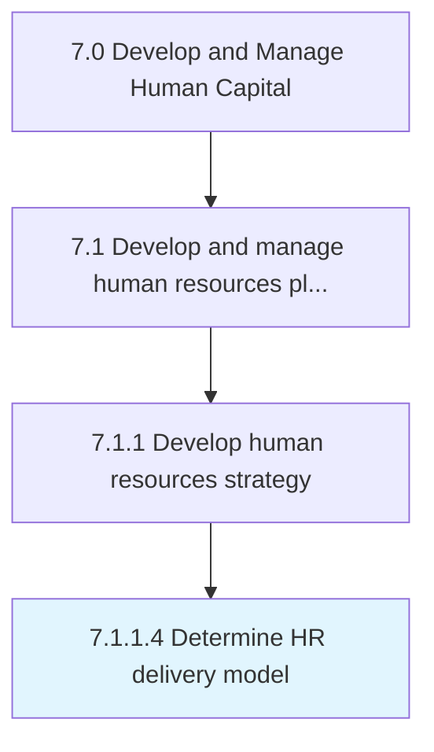
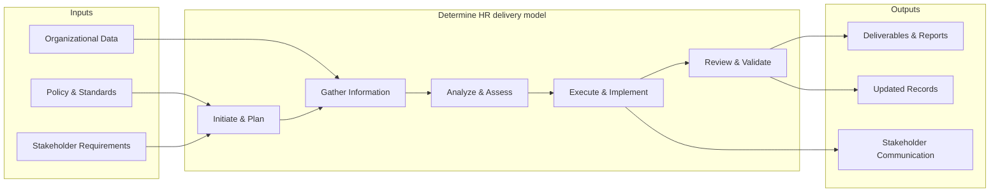

# Determine HR delivery model

> Determining how an organization's human resources department offers services to and interacts with employees.

## Overview

Activity 7.1.1.4 is an activity within the Develop and Manage Human Capital framework. 

Determining how an organization's human resources department offers services to and interacts with employees.

This process involves systematic analysis and determination of h r delivery model. It requires data gathering, stakeholder input, comparative analysis, and structured decision-making to arrive at well-informed conclusions that support organizational objectives.

## Process Hierarchy



## Key Statistics

| Metric | Value |
|--------|-------|
| APQC Code | 21431 |
| Hierarchy ID | 7.1.1.4 |
| Level | Activity |
| Parent | [7.1.1](../) |
| Sub-Processes | 0 |


## GraphDL Semantic Structure

```graphdl
determine.HRDeliveryModel
```

| Component | Value | Description |
|-----------|-------|-------------|
| Verb | `determine` | Primary action |
| Object | `HR delivery model` | Direct object |


## Related Concepts

- HRDeliveryModel


## Process Flow



## RACI Matrix

| Activity | Responsible | Accountable | Consulted | Informed |
|----------|------------|-------------|-----------|----------|
| Define HR strategy | HR Director | CHRO | C-Suite | All Employees |
| Allocate HR budget | HR Director | CFO | Finance | Department Heads |
| Design org structure | HR Business Partner | CHRO | Department Heads | Employees |

## Related Occupations

- [Human Resources Managers](/occupations/Management/HumanResourcesManagers)
- [Compensation and Benefits Managers](/occupations/Management/CompensationAndBenefitsManagers)
- [Training and Development Managers](/occupations/Management/TrainingAndDevelopmentManagers)
- [Chief Executives](/occupations/Management/ChiefExecutives)
- [Management Analysts](/occupations/Business/Operations/ManagementAnalysts)

## Related Departments

- Human Resources
- Executive Leadership
- Finance

## Industry Variations

### Healthcare

Must account for clinical credentialing requirements, shift-based workforce models, and strict regulatory compliance (HIPAA, OSHA) when developing HR strategy.

### Technology

Focuses on rapid scaling, competitive talent markets, stock-based compensation strategies, and remote-first workforce planning.

### Manufacturing

Emphasizes union workforce considerations, safety certifications, skilled trade pipelines, and shift scheduling across multiple plant locations.

## KPIs & Metrics

| Metric | Description | Target |
|--------|-------------|--------|
| HR Cost per Employee | Total HR department cost divided by headcount | < $1,500/employee |
| HR-to-Employee Ratio | Number of HR FTEs per 100 employees | 1.0-1.4 per 100 |
| Strategic Alignment Score | Degree of HR strategy alignment with business objectives | > 80% |
| Workforce Plan Accuracy | Accuracy of headcount and skills forecasting | > 90% |

---

*Source: APQC PCF 21431 (7.1.1.4) - APQC*
