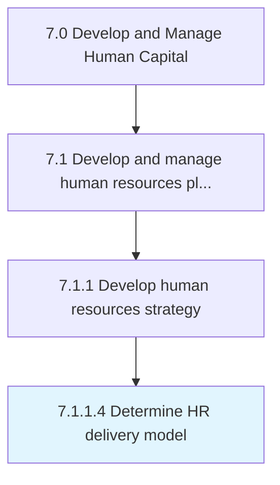

# Determine HR delivery model

> Determining how an organization's human resources department offers services to and interacts with employees.

## Overview

Activity 7.1.1.4 is an activity within the Develop and Manage Human Capital framework. 

Determining how an organization's human resources department offers services to and interacts with employees.

## Process Hierarchy



## Key Statistics

| Metric | Value |
|--------|-------|
| APQC Code | 21431 |
| Hierarchy ID | 7.1.1.4 |
| Level | Activity |
| Parent | [7.1.1](../) |
| Sub-Processes | 0 |


## GraphDL Semantic Structure

```
determine.HRDeliveryModel
```

| Component | Value | Description |
|-----------|-------|-------------|
| Verb | `determine` | Primary action |
| Object | `HR delivery model` | Direct object |


## Related Concepts

- [HRDeliveryModel](/concepts/HRDeliveryModel)


---

*Source: APQC PCF 21431 (7.1.1.4) - APQC*
