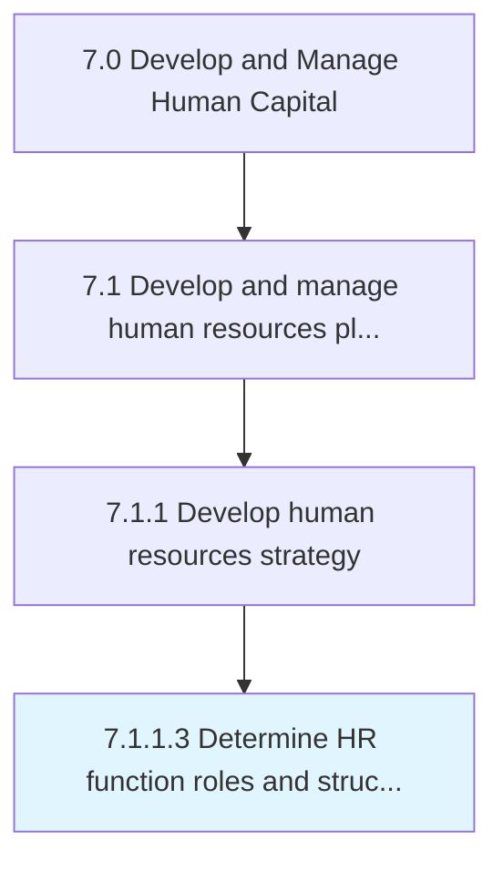

# Determine HR function roles and structure

> Establishing the roles that are required to execute the HR function.

## Overview

Activity 7.1.1.3 is an activity within the Develop and Manage Human Capital framework. 

Establishing the roles that are required to execute the HR function. This process also examines the organizational structure required to support the organization.

## Process Hierarchy



## Key Statistics

| Metric | Value |
|--------|-------|
| APQC Code | 21430 |
| Hierarchy ID | 7.1.1.3 |
| Level | Activity |
| Parent | [7.1.1](../) |
| Sub-Processes | 0 |


## GraphDL Semantic Structure

```
determine.HRFunctionRolesAndStructure
```

| Component | Value | Description |
|-----------|-------|-------------|
| Verb | `determine` | Primary action |
| Object | `HR function roles and structure` | Direct object |


## Related Concepts

- [HRFunctionRoles](/concepts/HRFunctionRoles)
- [Structure](/concepts/Structure)


---

*Source: APQC PCF 21430 (7.1.1.3) - APQC*
