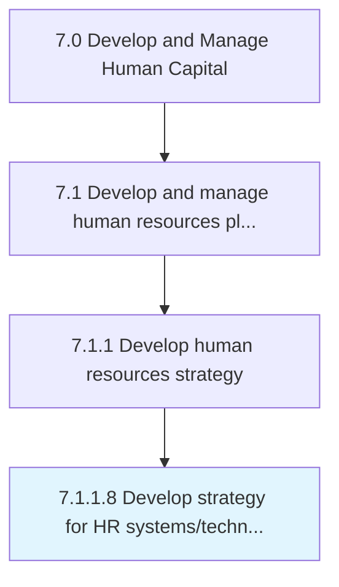

# Develop strategy for HR systems/technologies/tools

> Creating a strategy for the use of systems/technologies/tools in operating the HR function.

## Overview

Activity 7.1.1.8 is an activity within the Develop and Manage Human Capital framework. 

Creating a strategy for the use of systems/technologies/tools in operating the HR function. Create a strategy concerning the use and utility of HR support tools and technologies. Decide what specific tools to use and in what quantity. Determine the levels of technology required for the HR management.

## Process Hierarchy



## Key Statistics

| Metric | Value |
|--------|-------|
| APQC Code | 10432 |
| Hierarchy ID | 7.1.1.8 |
| Level | Activity |
| Parent | [7.1.1](../) |
| Sub-Processes | 0 |


## GraphDL Semantic Structure

```
develop.Strategy.for.HRSystemstechnologiestools
```

| Component | Value | Description |
|-----------|-------|-------------|
| Verb | `develop` | Primary action |
| Object | `strategy` | Direct object |
| Preposition | `for` | Relationship |
| PrepObject | `HR systems/technologies/tools` | Indirect object |


## Related Concepts

- Strategy
- HRSystems
- Strategy
- HRTechnologies
- Strategy
- HRTools


---

*Source: APQC PCF 10432 (7.1.1.8) - APQC*
