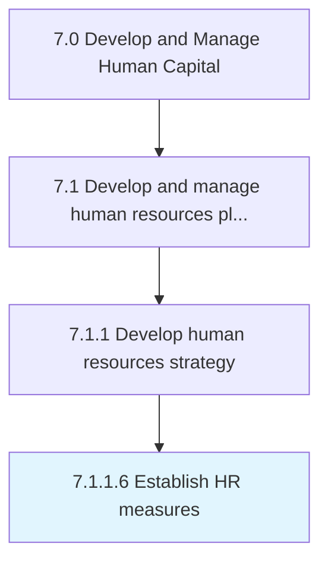

# Establish HR measures

> Evaluating the performance of HR function.

## Overview

Activity 7.1.1.6 is an activity within the Develop and Manage Human Capital framework. 

Evaluating the performance of HR function. Lay out the course of HR procedures that would formulate a plan of action needed to fulfill strategic HR needs. Deploy measures such as hiring policies, leave management, internal code of conducts, and compensation structure.

## Process Hierarchy



## Key Statistics

| Metric | Value |
|--------|-------|
| APQC Code | 10421 |
| Hierarchy ID | 7.1.1.6 |
| Level | Activity |
| Parent | [7.1.1](../) |
| Sub-Processes | 0 |


## GraphDL Semantic Structure

```
establish.HRMeasures
```

| Component | Value | Description |
|-----------|-------|-------------|
| Verb | `establish` | Primary action |
| Object | `HR measures` | Direct object |


## Related Concepts

- [HRMeasures](/concepts/HRMeasures)


---

*Source: APQC PCF 10421 (7.1.1.6) - APQC*
