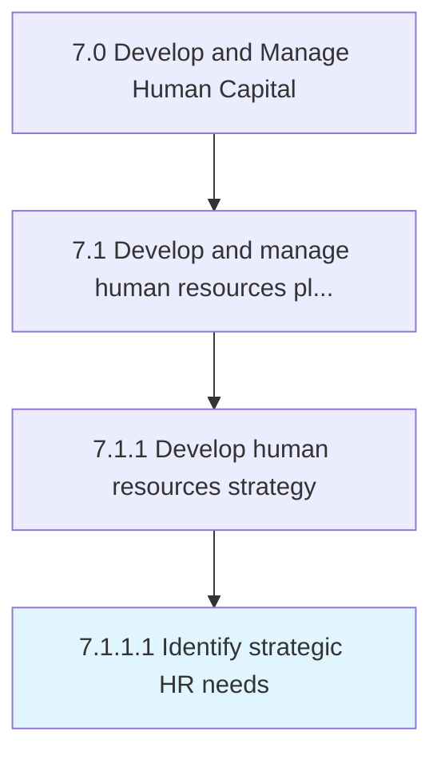

# Identify strategic HR needs

> Strategically defining the current and future needs for developing an efficient HR strategy.

## Overview

Activity 7.1.1.1 is an activity within the Develop and Manage Human Capital framework. 

Strategically defining the current and future needs for developing an efficient HR strategy.

## Process Hierarchy



## Key Statistics

| Metric | Value |
|--------|-------|
| APQC Code | 10418 |
| Hierarchy ID | 7.1.1.1 |
| Level | Activity |
| Parent | [7.1.1](../) |
| Sub-Processes | 0 |


## GraphDL Semantic Structure

```
identify.StrategicHRNeeds
```

| Component | Value | Description |
|-----------|-------|-------------|
| Verb | `identify` | Primary action |
| Object | `strategic HR needs` | Direct object |


## Related Concepts

- [StrategicHRNeeds](/concepts/StrategicHRNeeds)


---

*Source: APQC PCF 10418 (7.1.1.1) - APQC*
