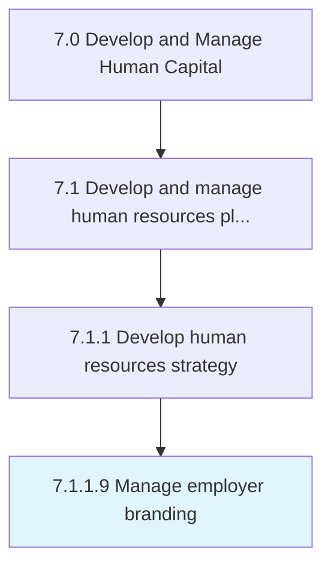

# Manage employer branding

> Creating, maintaining and communicating company's reputation and values to keep current employees and attract potential hires.

## Overview

Activity 7.1.1.9 is an activity within the Develop and Manage Human Capital framework. 

Creating, maintaining and communicating company's reputation and values to keep current employees and attract potential hires.

## Process Hierarchy



## Key Statistics

| Metric | Value |
|--------|-------|
| APQC Code | 20606 |
| Hierarchy ID | 7.1.1.9 |
| Level | Activity |
| Parent | [7.1.1](../) |
| Sub-Processes | 0 |


## GraphDL Semantic Structure

```
manage.EmployerBranding
```

| Component | Value | Description |
|-----------|-------|-------------|
| Verb | `manage` | Primary action |
| Object | `employer branding` | Direct object |


## Related Concepts

- EmployerBranding


---

*Source: APQC PCF 20606 (7.1.1.9) - APQC*
