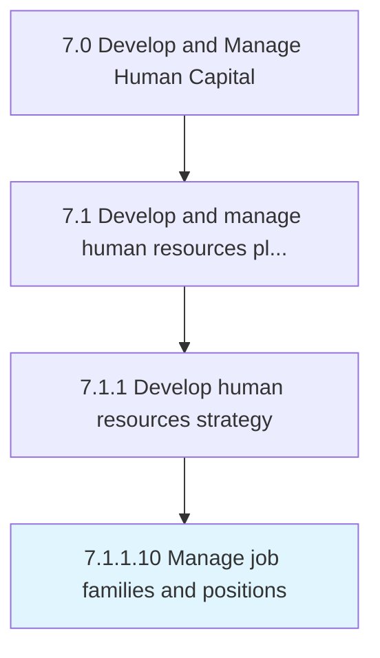

# Manage job families and positions

> Overseeing a group of similar individual or teams with similar education, skills, training, or experience.

## Overview

Activity 7.1.1.10 is an activity within the Develop and Manage Human Capital framework. 

Overseeing a group of similar individual or teams with similar education, skills, training, or experience.

## Process Hierarchy



## Key Statistics

| Metric | Value |
|--------|-------|
| APQC Code | 21432 |
| Hierarchy ID | 7.1.1.10 |
| Level | Activity |
| Parent | [7.1.1](../) |
| Sub-Processes | 0 |


## GraphDL Semantic Structure

```
manage.JobFamiliesAndPositions
```

| Component | Value | Description |
|-----------|-------|-------------|
| Verb | `manage` | Primary action |
| Object | `job families and positions` | Direct object |


## Related Concepts

- [JobFamilies](/concepts/JobFamilies)
- [Positions](/concepts/Positions)


---

*Source: APQC PCF 21432 (7.1.1.10) - APQC*
