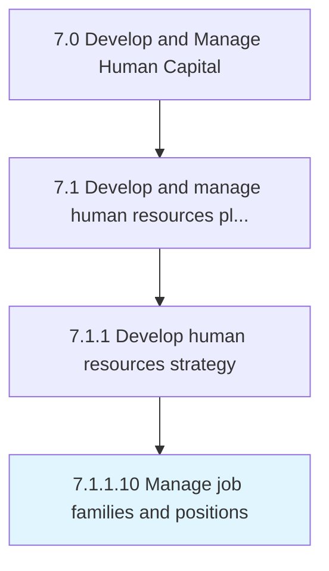
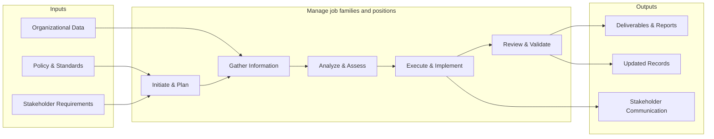

# Manage job families and positions

> Overseeing a group of similar individual or teams with similar education, skills, training, or experience.

## Overview

Activity 7.1.1.10 is an activity within the Develop and Manage Human Capital framework. 

Overseeing a group of similar individual or teams with similar education, skills, training, or experience.

This process provides a structured approach to managing job families and positions across the organization. It includes establishing governance frameworks, defining operational procedures, monitoring performance, ensuring compliance with policies and regulations, and driving continuous improvement through data-driven insights.

## Process Hierarchy



## Key Statistics

| Metric | Value |
|--------|-------|
| APQC Code | 21432 |
| Hierarchy ID | 7.1.1.10 |
| Level | Activity |
| Parent | [7.1.1](../) |
| Sub-Processes | 0 |


## GraphDL Semantic Structure

```
manage.JobFamiliesAndPositions
```

| Component | Value | Description |
|-----------|-------|-------------|
| Verb | `manage` | Primary action |
| Object | `job families and positions` | Direct object |


## Related Concepts

- JobFamilies
- Positions


## Process Flow



## RACI Matrix

| Activity | Responsible | Accountable | Consulted | Informed |
|----------|------------|-------------|-----------|----------|
| Define HR strategy | HR Director | CHRO | C-Suite | All Employees |
| Allocate HR budget | HR Director | CFO | Finance | Department Heads |
| Design org structure | HR Business Partner | CHRO | Department Heads | Employees |

## Related Occupations

- [Human Resources Managers](/occupations/HumanResourcesManagers)
- [Compensation and Benefits Managers](/occupations/CompensationAndBenefitsManagers)
- [Training and Development Managers](/occupations/TrainingAndDevelopmentManagers)
- [Chief Executives](/occupations/ChiefExecutives)
- [Management Analysts](/occupations/ManagementAnalysts)

## Related Departments

- Human Resources
- Executive Leadership
- Finance

## Industry Variations

### Healthcare

Must account for clinical credentialing requirements, shift-based workforce models, and strict regulatory compliance (HIPAA, OSHA) when developing HR strategy.

### Technology

Focuses on rapid scaling, competitive talent markets, stock-based compensation strategies, and remote-first workforce planning.

### Manufacturing

Emphasizes union workforce considerations, safety certifications, skilled trade pipelines, and shift scheduling across multiple plant locations.

## KPIs & Metrics

| Metric | Description | Target |
|--------|-------------|--------|
| HR Cost per Employee | Total HR department cost divided by headcount | < $1,500/employee |
| HR-to-Employee Ratio | Number of HR FTEs per 100 employees | 1.0-1.4 per 100 |
| Strategic Alignment Score | Degree of HR strategy alignment with business objectives | > 80% |
| Workforce Plan Accuracy | Accuracy of headcount and skills forecasting | > 90% |

---

*Source: APQC PCF 21432 (7.1.1.10) - APQC*
