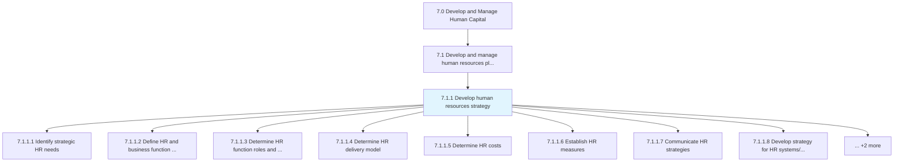
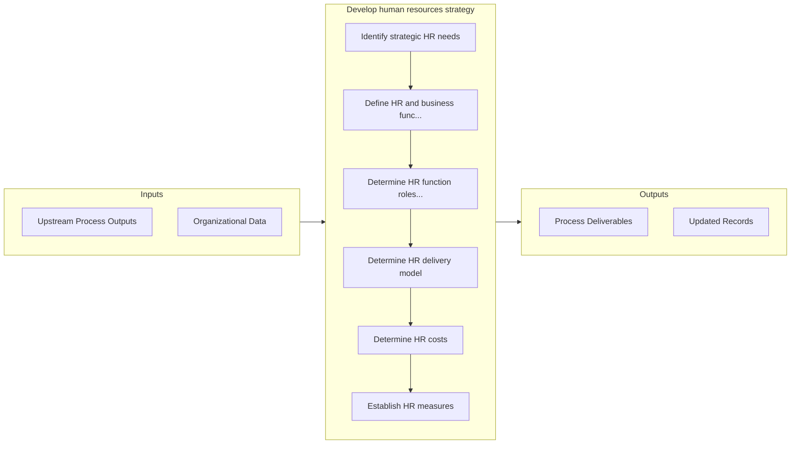

# Develop human resources strategy

> Creating a long-term plan to associate human resource requirements with the strategic goals of the company to ensure that there is enough qualified staffing to achieve those goals, to maintain competitive advantage and to reduce employee turnover.

## Overview

Process 7.1.1 is a core process that defines the specific procedures for develop human resources strategy. 

Creating a long-term plan to associate human resource requirements with the strategic goals of the company to ensure that there is enough qualified staffing to achieve those goals, to maintain competitive advantage and to reduce employee turnover.

## Process Hierarchy



## Key Statistics

| Metric | Value |
|--------|-------|
| APQC Code | 20958 |
| Hierarchy ID | 7.1.1 |
| Level | Process |
| Parent | [7.1](../) |
| Sub-Processes | 10 |


## GraphDL Semantic Structure

```
develop.HumanResourcesStrategy
```

| Component | Value | Description |
|-----------|-------|-------------|
| Verb | `develop` | Primary action |
| Object | `human resources strategy` | Direct object |


## Process Flow



## Sub-Processes

| Process | Hierarchy ID | Description |
|---------|-------------|-------------|
| [Identify strategic HR needs](./IdentifyStrategicHRNeeds) | 7.1.1.1 | Strategically defining the current and future needs for developing an efficient HR strategy |
| [Define HR and business function roles and accountability](./DefineHRAndBusinessFunctionRolesAndAccountability) | 7.1.1.2 | Outlining the charge and duty of the HR function by defining its responsibility areas, as well as en |
| [Determine HR function roles and structure](./DetermineHRFunctionRolesAndStructure) | 7.1.1.3 | Establishing the roles that are required to execute the HR function |
| [Determine HR delivery model](./DetermineHRDeliveryModel) | 7.1.1.4 | Determining how an organization's human resources department offers services to and interacts with e |
| [Determine HR costs](./DetermineHRCosts) | 7.1.1.5 | Ascertaining the costs and expenses of the HR function |
| [Establish HR measures](./EstablishHRMeasures) | 7.1.1.6 | Evaluating the performance of HR function |
| [Communicate HR strategies](./CommunicateHRStrategies) | 7.1.1.7 | Conveying the strategies of HR function to employees and management |
| [Develop strategy for HR systems/technologies/tools](./DevelopStrategyForHRSystemstechnologiestools) | 7.1.1.8 | Creating a strategy for the use of systems/technologies/tools in operating the HR function |
| [Manage employer branding](./ManageEmployerBranding) | 7.1.1.9 | Creating, maintaining and communicating company's reputation and values to keep current employees an |
| [Manage job families and positions](./ManageJobFamiliesAndPositions) | 7.1.1.10 | Overseeing a group of similar individual or teams with similar education, skills, training, or exper |


## Related Concepts

- [HumanResourcesStrategy](/concepts/HumanResourcesStrategy)


---

*Source: APQC PCF 20958 (7.1.1) - APQC*
