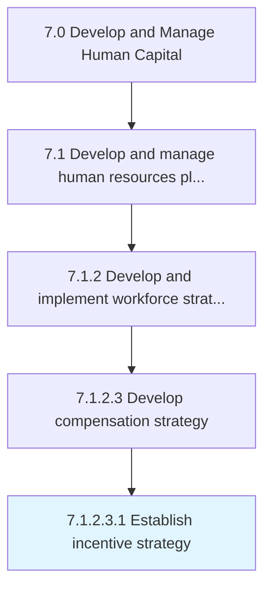

# Establish incentive strategy

> Creating a scheme of awards and recognition for sales employees to promote a results-based culture.

## Overview

Sub-Activity 7.1.2.3.1 is an activity within the Develop and Manage Human Capital framework. 

Creating a scheme of awards and recognition for sales employees to promote a results-based culture. Create specific incentives to reach desired outcomes, such as landing key clients, growing the customer base, providing exceptional servicing, and increasing profit margins.

## Process Hierarchy



## Key Statistics

| Metric | Value |
|--------|-------|
| APQC Code | 10210 |
| Hierarchy ID | 7.1.2.3.1 |
| Level | Sub-Activity |
| Parent | [7.1.2.3](../) |
| Sub-Processes | 0 |


## GraphDL Semantic Structure

```
establish.IncentiveStrategy
```

| Component | Value | Description |
|-----------|-------|-------------|
| Verb | `establish` | Primary action |
| Object | `incentive strategy` | Direct object |


## Related Concepts

- [IncentiveStrategy](/concepts/IncentiveStrategy)


---

*Source: APQC PCF 10210 (7.1.2.3.1) - APQC*
