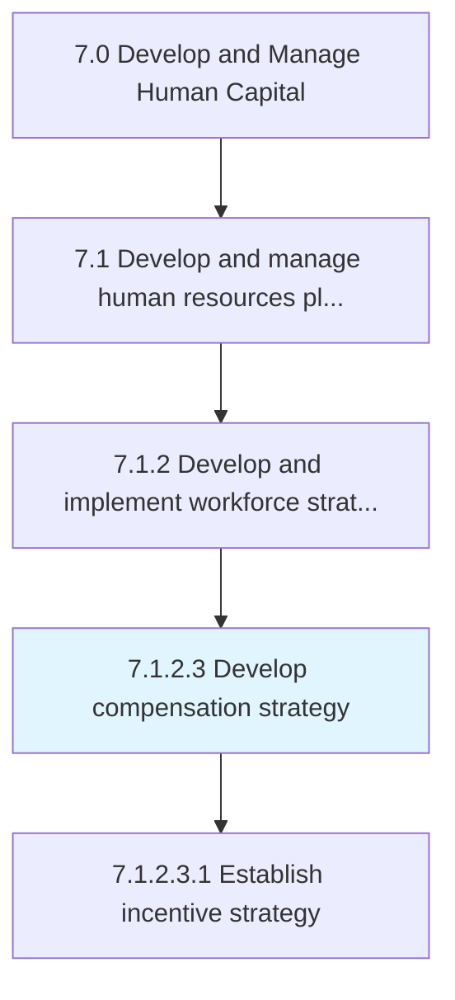
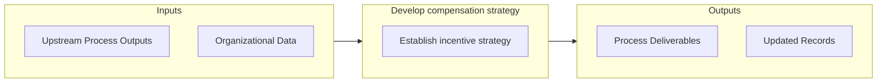
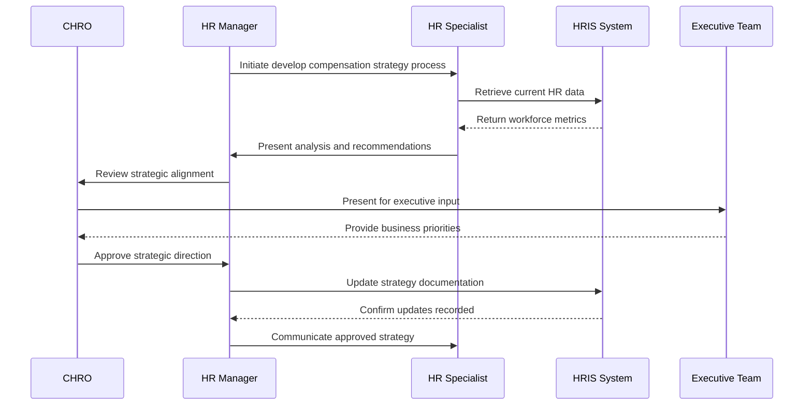

# Develop compensation strategy

> Designing a plan that specifies the combination of wages, salaries, and benefits the employees receive in exchange for work.

## Overview

Activity 7.1.2.3 is an activity within the Develop and Manage Human Capital framework. 

Designing a plan that specifies the combination of wages, salaries, and benefits the employees receive in exchange for work. Define the total amount of compensation, in addition to the manner in which the compensation is paid and the purposes for which employees can receive bonuses, salary increases, and incentives.

## Process Hierarchy



## Key Statistics

| Metric | Value |
|--------|-------|
| APQC Code | 10425 |
| Hierarchy ID | 7.1.2.3 |
| Level | Activity |
| Parent | [7.1.2](../) |
| Sub-Processes | 1 |


## GraphDL Semantic Structure

```graphdl
develop.CompensationStrategy
```

| Component | Value | Description |
|-----------|-------|-------------|
| Verb | `develop` | Primary action |
| Object | `compensation strategy` | Direct object |


## Process Flow



## Sub-Processes

| Process | Hierarchy ID | Description |
|---------|-------------|-------------|
| [Establish incentive strategy](./EstablishIncentiveStrategy) | 7.1.2.3.1 | Creating a scheme of awards and recognition for sales employees to promote a results-based culture |


## Related Concepts

- CompensationStrategy


## Process Sequence



---

*Source: APQC PCF 10425 (7.1.2.3) - APQC*
