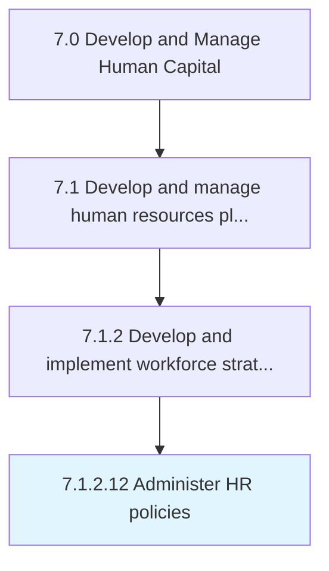

# Administer HR policies

> Ensuring rules and regulations are followed and are flexible enough to accommodate indispensable deviations.

## Overview

Activity 7.1.2.12 is an activity within the Develop and Manage Human Capital framework. 

Ensuring rules and regulations are followed and are flexible enough to accommodate indispensable deviations.

## Process Hierarchy



## Key Statistics

| Metric | Value |
|--------|-------|
| APQC Code | 10430 |
| Hierarchy ID | 7.1.2.12 |
| Level | Activity |
| Parent | [7.1.2](../) |
| Sub-Processes | 0 |


## GraphDL Semantic Structure

```
administer.HRPolicies
```

| Component | Value | Description |
|-----------|-------|-------------|
| Verb | `administer` | Primary action |
| Object | `HR policies` | Direct object |


## Related Concepts

- [HRPolicies](/concepts/HRPolicies)


---

*Source: APQC PCF 10430 (7.1.2.12) - APQC*
