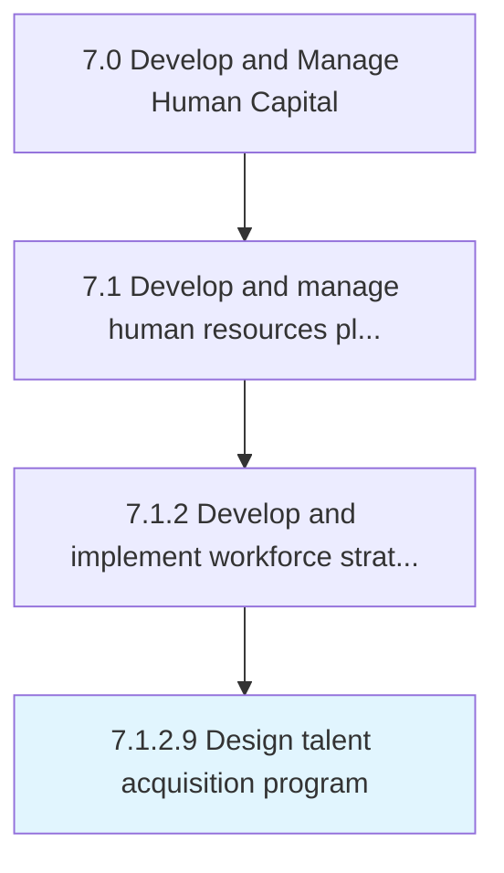

# Design talent acquisition program

> Developing a program to entice prospective resources to engage with the organization for a position of employment.

## Overview

Activity 7.1.2.9 is an activity within the Develop and Manage Human Capital framework. 

Developing a program to entice prospective resources to engage with the organization for a position of employment.

## Process Hierarchy



## Key Statistics

| Metric | Value |
|--------|-------|
| APQC Code | 11623 |
| Hierarchy ID | 7.1.2.9 |
| Level | Activity |
| Parent | [7.1.2](../) |
| Sub-Processes | 0 |


## GraphDL Semantic Structure

```
design.TalentAcquisitionProgram
```

| Component | Value | Description |
|-----------|-------|-------------|
| Verb | `design` | Primary action |
| Object | `talent acquisition program` | Direct object |


## Related Concepts

- [TalentAcquisitionProgram](/concepts/TalentAcquisitionProgram)


---

*Source: APQC PCF 11623 (7.1.2.9) - APQC*
