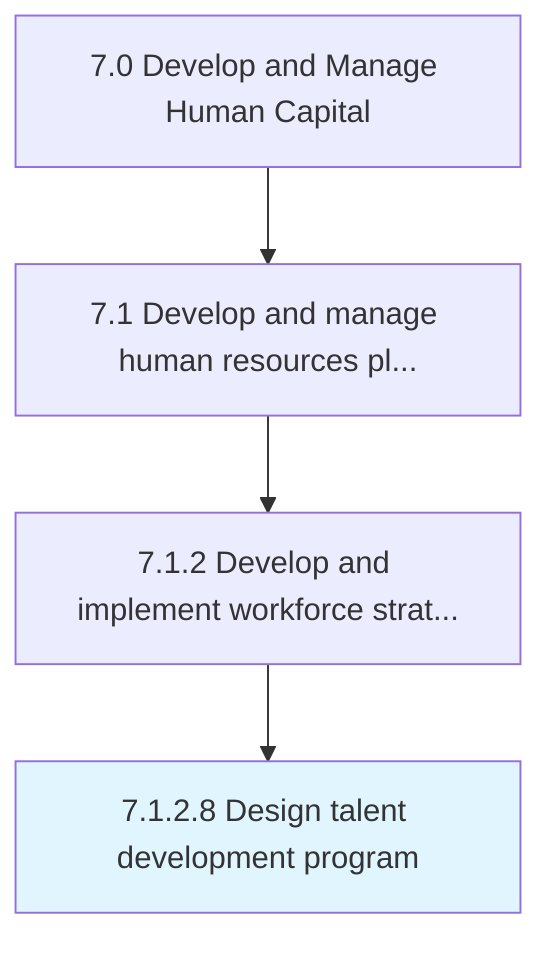

# Design talent development program

> Identifying skills, knowledge, and attributes that need enhancement in order to perform a job.

## Overview

Activity 7.1.2.8 is an activity within the Develop and Manage Human Capital framework. 

Identifying skills, knowledge, and attributes that need enhancement in order to perform a job. Develop the appropriate training programs. These programs can be computer-based, classroom, or on-the-job training, etc.

## Process Hierarchy



## Key Statistics

| Metric | Value |
|--------|-------|
| APQC Code | 11622 |
| Hierarchy ID | 7.1.2.8 |
| Level | Activity |
| Parent | [7.1.2](../) |
| Sub-Processes | 0 |


## GraphDL Semantic Structure

```
design.TalentDevelopmentProgram
```

| Component | Value | Description |
|-----------|-------|-------------|
| Verb | `design` | Primary action |
| Object | `talent development program` | Direct object |


## Related Concepts

- [TalentDevelopmentProgram](/concepts/TalentDevelopmentProgram)


---

*Source: APQC PCF 11622 (7.1.2.8) - APQC*
