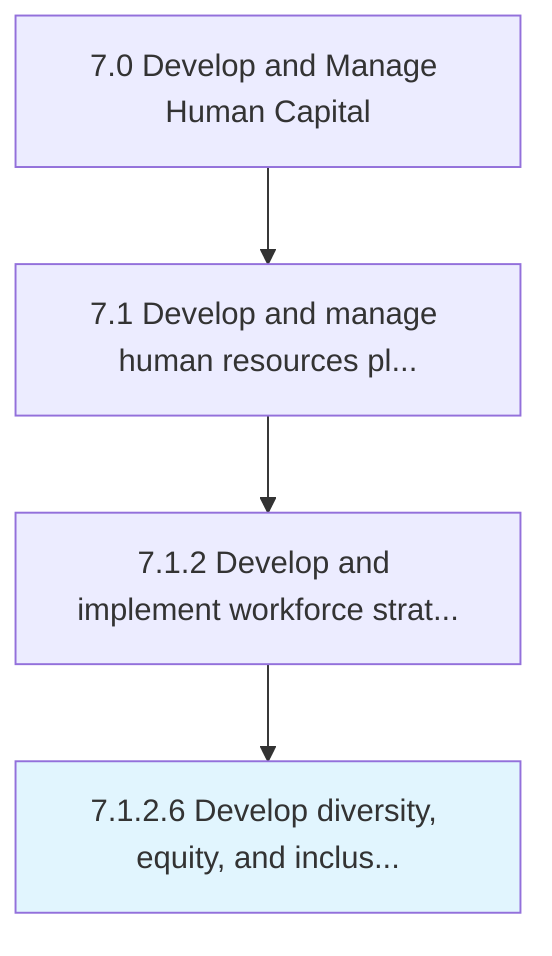

# Develop diversity, equity, and inclusion plan

> Creating and implementing the plan for ensuring a diverse work force.

## Overview

Activity 7.1.2.6 is an activity within the Develop and Manage Human Capital framework. 

Creating and implementing the plan for ensuring a diverse work force. Develop and hire employees with varying characteristics including, but not limited to, religious and political beliefs, gender, ethnicity, education, socioeconomic background, sexual orientation, and geographic location.

## Process Hierarchy



## Key Statistics

| Metric | Value |
|--------|-------|
| APQC Code | 10427 |
| Hierarchy ID | 7.1.2.6 |
| Level | Activity |
| Parent | [7.1.2](../) |
| Sub-Processes | 0 |


## GraphDL Semantic Structure

```
develop.DiversityEquityAndInclusionPlan
```

| Component | Value | Description |
|-----------|-------|-------------|
| Verb | `develop` | Primary action |
| Object | `diversity, equity, and inclusion plan` | Direct object |


## Related Concepts

- Diversity
- Equity
- InclusionPlan


---

*Source: APQC PCF 10427 (7.1.2.6) - APQC*
