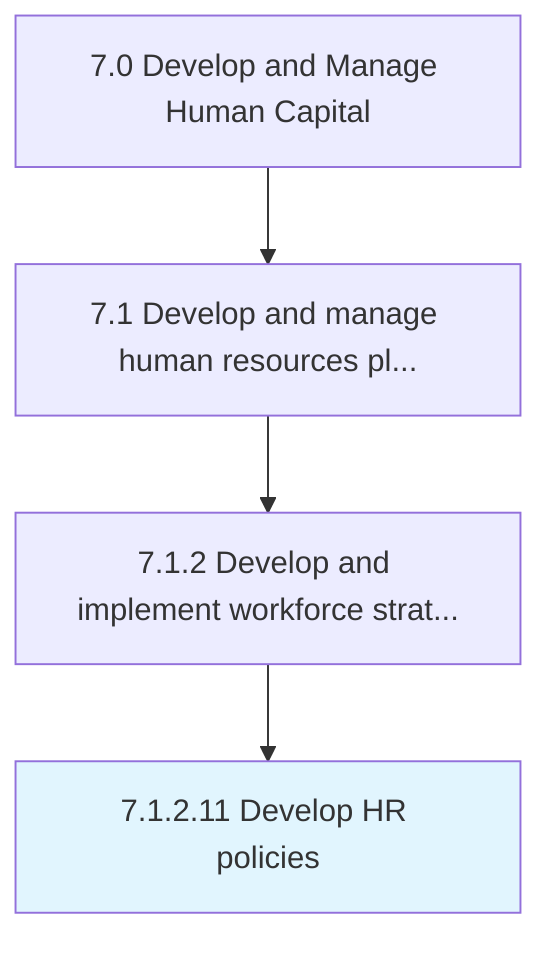

# Develop HR policies

> Creating rules and regulations that govern the HR function.

## Overview

Activity 7.1.2.11 is an activity within the Develop and Manage Human Capital framework. 

Creating rules and regulations that govern the HR function. Develop a policy plan that serves as a guideline for setting rules and regulations that help in achieving the HR goals and objectives.

## Process Hierarchy



## Key Statistics

| Metric | Value |
|--------|-------|
| APQC Code | 10429 |
| Hierarchy ID | 7.1.2.11 |
| Level | Activity |
| Parent | [7.1.2](../) |
| Sub-Processes | 0 |


## GraphDL Semantic Structure

```
develop.HRPolicies
```

| Component | Value | Description |
|-----------|-------|-------------|
| Verb | `develop` | Primary action |
| Object | `HR policies` | Direct object |


## Related Concepts

- HRPolicies


---

*Source: APQC PCF 10429 (7.1.2.11) - APQC*
