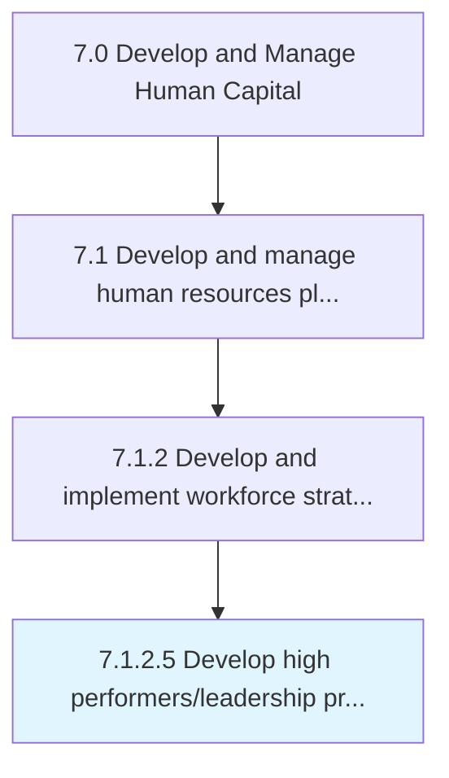

# Develop high performers/leadership programs

> Creating a program that incorporates incentives and compensation put forth by the organization to recognize high performing workers and excellence in leadership.

## Overview

Activity 7.1.2.5 is an activity within the Develop and Manage Human Capital framework. 

Creating a program that incorporates incentives and compensation put forth by the organization to recognize high performing workers and excellence in leadership.

## Process Hierarchy



## Key Statistics

| Metric | Value |
|--------|-------|
| APQC Code | 16938 |
| Hierarchy ID | 7.1.2.5 |
| Level | Activity |
| Parent | [7.1.2](../) |
| Sub-Processes | 0 |


## GraphDL Semantic Structure

```
develop.HighPerformersleadershipPrograms
```

| Component | Value | Description |
|-----------|-------|-------------|
| Verb | `develop` | Primary action |
| Object | `high performers/leadership programs` | Direct object |


## Related Concepts

- [HighPerformersPrograms](/concepts/HighPerformersPrograms)
- [HighLeadershipPrograms](/concepts/HighLeadershipPrograms)


---

*Source: APQC PCF 16938 (7.1.2.5) - APQC*
