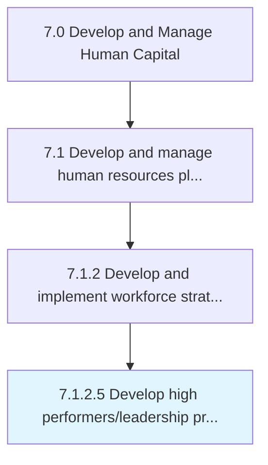
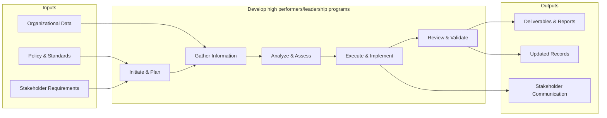
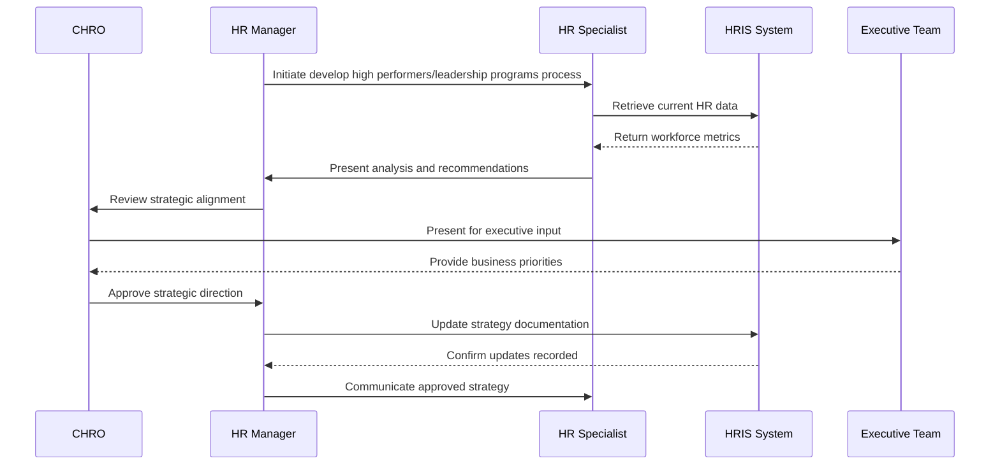

# Develop high performers/leadership programs

> Creating a program that incorporates incentives and compensation put forth by the organization to recognize high performing workers and excellence in leadership.

## Overview

Activity 7.1.2.5 is an activity within the Develop and Manage Human Capital framework. 

Creating a program that incorporates incentives and compensation put forth by the organization to recognize high performing workers and excellence in leadership.

This process encompasses the end-to-end development of high performersleadership programs, from initial needs assessment through design, implementation, and evaluation. It requires cross-functional collaboration, alignment with organizational objectives, and iterative refinement based on stakeholder feedback and performance metrics.

## Process Hierarchy



## Key Statistics

| Metric | Value |
|--------|-------|
| APQC Code | 16938 |
| Hierarchy ID | 7.1.2.5 |
| Level | Activity |
| Parent | [7.1.2](../) |
| Sub-Processes | 0 |


## GraphDL Semantic Structure

```graphdl
develop.HighPerformersleadershipPrograms
```

| Component | Value | Description |
|-----------|-------|-------------|
| Verb | `develop` | Primary action |
| Object | `high performers/leadership programs` | Direct object |


## Related Concepts

- HighPerformersPrograms
- HighLeadershipPrograms


## Process Flow



## Process Sequence



## RACI Matrix

| Activity | Responsible | Accountable | Consulted | Informed |
|----------|------------|-------------|-----------|----------|
| Define HR strategy | HR Director | CHRO | C-Suite | All Employees |
| Allocate HR budget | HR Director | CFO | Finance | Department Heads |
| Design org structure | HR Business Partner | CHRO | Department Heads | Employees |

## Related Occupations

- [Human Resources Managers](/occupations/Management/HumanResourcesManagers)
- [Compensation and Benefits Managers](/occupations/Management/CompensationAndBenefitsManagers)
- [Training and Development Managers](/occupations/Management/TrainingAndDevelopmentManagers)
- [Chief Executives](/occupations/Management/ChiefExecutives)
- [Management Analysts](/occupations/Business/Operations/ManagementAnalysts)

## Related Departments

- Human Resources
- Executive Leadership
- Finance

## Industry Variations

### Healthcare

Must account for clinical credentialing requirements, shift-based workforce models, and strict regulatory compliance (HIPAA, OSHA) when developing HR strategy.

### Technology

Focuses on rapid scaling, competitive talent markets, stock-based compensation strategies, and remote-first workforce planning.

### Manufacturing

Emphasizes union workforce considerations, safety certifications, skilled trade pipelines, and shift scheduling across multiple plant locations.

## KPIs & Metrics

| Metric | Description | Target |
|--------|-------------|--------|
| HR Cost per Employee | Total HR department cost divided by headcount | < $1,500/employee |
| HR-to-Employee Ratio | Number of HR FTEs per 100 employees | 1.0-1.4 per 100 |
| Strategic Alignment Score | Degree of HR strategy alignment with business objectives | > 80% |
| Workforce Plan Accuracy | Accuracy of headcount and skills forecasting | > 90% |

---

*Source: APQC PCF 16938 (7.1.2.5) - APQC*
