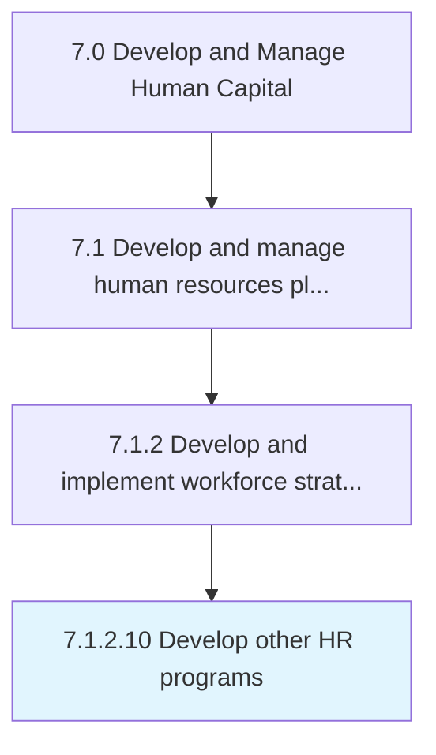

# Develop other HR programs

> Creating HR programs and services such as employee engagements programs to promote positive employee behavior.

## Overview

Activity 7.1.2.10 is an activity within the Develop and Manage Human Capital framework. 

Creating HR programs and services such as employee engagements programs to promote positive employee behavior. Create a variety of programs and services to support employees' professional and personal needs at work and at home.

## Process Hierarchy



## Key Statistics

| Metric | Value |
|--------|-------|
| APQC Code | 10428 |
| Hierarchy ID | 7.1.2.10 |
| Level | Activity |
| Parent | [7.1.2](../) |
| Sub-Processes | 0 |


## GraphDL Semantic Structure

```
develop.OtherHRPrograms
```

| Component | Value | Description |
|-----------|-------|-------------|
| Verb | `develop` | Primary action |
| Object | `other HR programs` | Direct object |


## Related Concepts

- [OtherHRPrograms](/concepts/OtherHRPrograms)


---

*Source: APQC PCF 10428 (7.1.2.10) - APQC*
