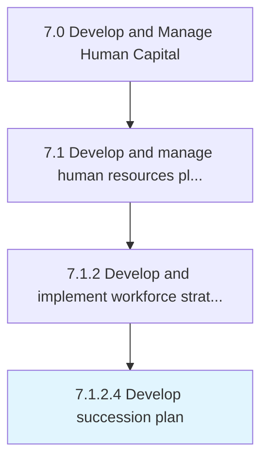

# Develop succession plan

> Creating and implementing the plan for continuation of key positions within the organization.

## Overview

Activity 7.1.2.4 is an activity within the Develop and Manage Human Capital framework. 

Creating and implementing the plan for continuation of key positions within the organization. Identify internal people with the potential to fill key business leadership positions. Provide critical development experiences to employees who can move into important roles. Engage leaders to support the development of high-potential leaders.

## Process Hierarchy



## Key Statistics

| Metric | Value |
|--------|-------|
| APQC Code | 10426 |
| Hierarchy ID | 7.1.2.4 |
| Level | Activity |
| Parent | [7.1.2](../) |
| Sub-Processes | 0 |


## GraphDL Semantic Structure

```
develop.SuccessionPlan
```

| Component | Value | Description |
|-----------|-------|-------------|
| Verb | `develop` | Primary action |
| Object | `succession plan` | Direct object |


## Related Concepts

- SuccessionPlan


---

*Source: APQC PCF 10426 (7.1.2.4) - APQC*
